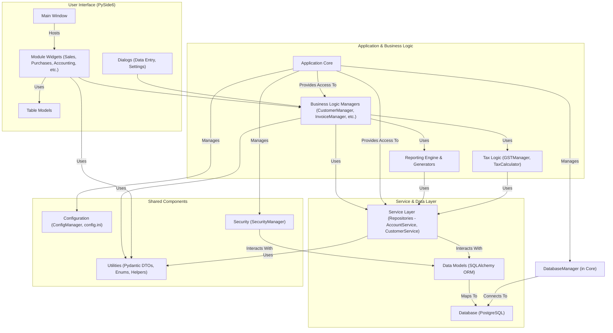

# SG Bookkeeper - Project Architecture Document (v2)

## 1. Introduction

This document outlines the software architecture of the SG Bookkeeper application. SG Bookkeeper is a desktop application designed to provide comprehensive bookkeeping and accounting functionalities tailored for small to medium-sized businesses, particularly focusing on requirements relevant to Singaporean businesses (e.g., GST handling).

The purpose of this document is to provide a clear understanding of the project's structure, components, their interactions, and the overall design principles.

## 2. Project Goals (Inferred)

Based on the codebase, the primary goals of the SG Bookkeeper project are:

*   **Comprehensive Accounting**: Provide robust double-entry bookkeeping capabilities, including Chart of Accounts management, Journal Entries, Fiscal Period control, and multi-currency support.
*   **Business Operations Management**: Manage core business entities and processes such as Customers, Vendors, Products/Services, Sales Invoices, Purchase Invoices, Payments, and Bank Account reconciliation.
*   **Tax Compliance**: Facilitate tax-related tasks, particularly GST (Goods and Services Tax) calculations, F5 return preparation, and potentially income tax computations.
*   **Financial Reporting**: Generate essential financial statements (Balance Sheet, Profit & Loss, Trial Balance, General Ledger) and other tax-related reports.
*   **User-Friendly Interface**: Offer an intuitive desktop GUI for users to interact with the system efficiently.
*   **Data Integrity and Auditability**: Ensure data accuracy and provide mechanisms for auditing changes and system actions.
*   **Security**: Manage user access and roles through an authentication and permission system.
*   **Configuration and Customization**: Allow for basic application and company-specific configurations.

## 3. Core Technologies

The project leverages the following core technologies:

*   **Python**: The primary programming language.
*   **PySide6 (Qt for Python)**: For the graphical user interface (GUI).
*   **SQLAlchemy**: For Object-Relational Mapping (ORM) and database interaction, particularly with its asyncio extension.
*   **asyncpg**: Asynchronous PostgreSQL driver used by SQLAlchemy.
*   **PostgreSQL**: The target relational database system.
*   **Pydantic**: For data validation, settings management, and creating Data Transfer Objects (DTOs).
*   **asyncio**: For managing asynchronous operations, crucial for a responsive UI with potentially long-running backend tasks.
*   **ReportLab**: For PDF report generation.
*   **Openpyxl**: For Excel report generation.
*   **bcrypt**: For password hashing.
*   **Alembic**: (Implied by `pyproject.toml`, though not explicitly used in provided files) Likely intended for database schema migrations.
*   **Poetry**: For dependency management and packaging.

## 4. Architectural Overview

SG Bookkeeper follows a multi-layered, modular architecture designed to separate concerns and promote maintainability. The main layers are:

1.  **Presentation Layer (UI)**: Built with PySide6, responsible for user interaction and displaying data. Resides in `app/ui/`.
2.  **Application Core Layer**: Orchestrates major components, manages configurations, database connections, and provides access to managers and services. Resides in `app/core/`.
3.  **Business Logic Layer (Managers)**: Contains higher-level business rules, use case implementations, and orchestrates operations involving multiple services or complex logic. Resides in `app/business_logic/`, `app/accounting/`, `app/tax/`, `app/reporting/`.
4.  **Service Layer (Repositories)**: Acts as a data access abstraction layer, implementing repository patterns for specific ORM models. Manages data retrieval and persistence. Resides in `app/services/`.
5.  **Data Model Layer (ORM)**: Defines the application's data structures using SQLAlchemy ORM, mapping Python classes to database tables. Resides in `app/models/`.
6.  **Database Layer**: PostgreSQL database, with schema defined in `scripts/schema.sql`.
7.  **Utility Layer**: Provides common helper functions, DTOs, enums, and other shared utilities. Resides in `app/utils/` and `app/common/`.

### Architecture Diagram (Mermaid Syntax)



**Diagram Description:**
The diagram illustrates a top-down flow.
*   The **User Interface** (top layer) interacts with the **Business Logic Managers**.
*   **Application Core** acts as a central hub, providing access to various managers and services, and managing cross-cutting concerns like configuration and security.
*   **Business Logic Managers** implement use cases and orchestrate operations, utilizing the **Service Layer**. They also interact with specialized components like the **Reporting Engine** and **Tax Logic**.
*   The **Service Layer** (Repositories) abstracts data access, working directly with **ORM Models**.
*   **ORM Models** map to the **Database**.
*   **Shared Components** like Utilities, Configuration, and Security are used across multiple layers.
*   The `DatabaseManager` (part of the Core) handles database connections for all data-accessing components.

## 5. Directory Structure and Key Modules

*   **`app/`**: Main application code.
    *   **`__init__.py`**: Package initializer.
    *   **`main.py`**: Application entry point, initializes Qt Application, `ApplicationCore`, and manages the asyncio event loop.
    *   **`accounting/`**: Contains managers specific to accounting core logic (e.g., `ChartOfAccountsManager`, `JournalEntryManager`).
    *   **`audit/`**: UI and potentially logic related to audit trails (e.g., `AuditLogWidget`).
    *   **`business_logic/`**: High-level managers for business entities like customers, vendors, products, invoices, payments.
    *   **`common/`**: Shared enumerations (`enums.py`).
    *   **`core/`**: Core application infrastructure (`ApplicationCore`, `ConfigManager`, `DatabaseManager`, `SecurityManager`).
    *   **`models/`**: SQLAlchemy ORM models, organized into subdirectories by schema (`accounting`, `audit`, `business`, `core`). `base.py` defines base mixins.
    *   **`reporting/`**: Logic for generating financial and tax reports (`FinancialStatementGenerator`, `ReportEngine`).
    *   **`services/`**: Data access layer (repositories) for ORM models (e.g., `AccountService`, `CustomerService`).
    *   **`tax/`**: Tax-specific logic (`GSTManager`, `TaxCalculator`).
    *   **`ui/`**: PySide6 GUI components, organized by feature/module (e.g., `customers`, `sales_invoices`, `settings`, `shared` for reusable UI parts).
    *   **`utils/`**: Utility functions, Pydantic models (DTOs), `Result` class, custom JSON helpers.
*   **`data/`**: Default data templates.
    *   **`chart_of_accounts/`**: CSV templates for Chart of Accounts.
    *   **`report_templates/`**: JSON templates for report structures.
    *   **`tax_codes/`**: CSV for default tax codes.
*   **`resources/`**: Static assets like icons (`icons/`) and images (`images/`).
    *   **`resources.qrc`**: Qt resource collection file for embedding assets.
    *   **`resources_rc.py`**: Compiled Python version of `resources.qrc`.
*   **`scripts/`**: Database initialization and schema scripts.
    *   **`db_init.py`**: Python script to initialize the database.
    *   **`initial_data.sql`**: SQL script for inserting default/seed data.
    *   **`schema.sql`**: SQL script defining the complete database schema.
*   **`tests/`**: Unit and integration tests (currently stubs).
*   **`pyproject.toml`**: Project metadata and dependencies (Poetry).
*   **`pyvenv.cfg`**: Virtual environment configuration.
*   **`/home/pete/.config/SGBookkeeper/config.ini`**: User-specific runtime configuration.

## 6. Detailed Component Breakdown

### 6.1. `app/core`

*   **`ApplicationCore` (`application_core.py`)**:
    *   Acts as the central orchestrator and service locator for the application.
    *   Initializes and holds instances of managers, services, and core components like `DatabaseManager`, `SecurityManager`, `ConfigManager`.
    *   Manages application startup and shutdown sequences, including database initialization.
    *   Provides properties for easy access to shared components (e.g., `app_core.customer_manager`).
*   **`ConfigManager` (`config_manager.py`)**:
    *   Manages application configuration stored in `config.ini`.
    *   Handles loading, creating default configurations, and providing access to settings.
*   **`DatabaseManager` (`database_manager.py`)**:
    *   Manages PostgreSQL database connections using `asyncpg` and SQLAlchemy's asyncio extension.
    *   Provides asynchronous session management (`session()` context manager) and direct connection access (`connection()` context manager).
    *   Handles setting `app.current_user_id` for database sessions for audit purposes.
*   **`SecurityManager` (`security_manager.py`)**:
    *   Manages user authentication (password hashing/verification with `bcrypt`).
    *   Handles user session (login/logout).
    *   Manages roles and permissions, including CRUD operations for users and roles.
    *   Provides authorization checks (`has_permission`).
*   **`ModuleManager` (`module_manager.py`)**:
    *   A generic manager for loading and accessing application modules or components. (Its specific heavy usage isn't fully demonstrated in the provided files beyond a conceptual `load_all_modules`).

### 6.2. `app/models`

*   Organized into subdirectories (`accounting`, `audit`, `business`, `core`) reflecting database schemas.
*   **`base.py`**: Defines `Base` for SQLAlchemy declarative mapping and `TimestampMixin`, `UserAuditMixin` for common audit columns.
*   **ORM Models**: Each Python file generally defines one or more SQLAlchemy ORM models mapping to database tables (e.g., `accounting/account.py` defines `Account`, `business/customer.py` defines `Customer`).
*   **Relationships**: Models define relationships (one-to-one, one-to-many, many-to-many) using SQLAlchemy's `relationship()` with `back_populates` for bi-directional linking.
*   **Constraints**: Table arguments (`__table_args__`) often include schema definitions and database-level constraints (e.g., `CheckConstraint`, `UniqueConstraint`).

### 6.3. `app/services`

*   Implements the Repository pattern, providing an abstraction layer over data access operations for specific ORM models.
*   **`__init__.py`**: Defines `IRepository` and other specific repository interfaces (e.g., `IAccountRepository`, `ICustomerRepository`).
*   **Service Implementations** (e.g., `AccountService`, `CustomerService`, `JournalService`, `core_services.py`, `accounting_services.py`, `business_services.py`, `audit_services.py`):
    *   Typically inherit from the corresponding `IRepository` interface.
    *   Use `DatabaseManager` for session management.
    *   Perform CRUD operations and custom queries using SQLAlchemy.
    *   Return ORM model instances or Pydantic DTOs (e.g., `CustomerSummaryData`).

### 6.4. `app/business_logic` & `app/accounting` (Managers)

*   Contain higher-level business operations, orchestrating calls to multiple services and implementing application-specific logic.
*   **Examples**:
    *   `CustomerManager`: Manages customer creation, updates, listing, validation.
    *   `SalesInvoiceManager`, `PurchaseInvoiceManager`: Handle invoice lifecycle (draft, posting, validation), including generating related journal entries and inventory movements.
    *   `PaymentManager`: Manages creation of payments/receipts, allocations to invoices, and generation of corresponding journal entries.
    *   `ChartOfAccountsManager`: Handles CoA operations, including creation, updates, deactivation, and tree generation.
    *   `JournalEntryManager`: Manages journal entry creation, updates, posting, reversal, and recurring entries.
*   Often use `Result` objects for returning success/failure status and error messages.
*   Depend on services for data persistence and retrieval.
*   Utilize Pydantic DTOs for input data validation and as structured data containers.

### 6.5. `app/tax`

*   **`GSTManager`**: Handles logic for preparing GST F5 return data, calculating GST amounts based on journal entries and tax codes, and saving/finalizing GST returns (including generating settlement JEs).
*   **`TaxCalculator`**: Provides utility for calculating tax amounts for transaction lines based on tax codes.
*   Other managers like `IncomeTaxManager` and `WithholdingTaxManager` are stubs for future expansion.

### 6.6. `app/reporting`

*   **`FinancialStatementGenerator`**: Contains logic to generate core financial reports like Balance Sheet, Profit & Loss, Trial Balance, and General Ledger by fetching data from services.
*   **`ReportEngine`**: Responsible for exporting generated report data into different formats (PDF using ReportLab, Excel using Openpyxl). Includes styling and layout for reports.
*   **`TaxReportGenerator`**: Stub for generating more complex tax-specific reports.

### 6.7. `app/ui`

*   Built using **PySide6 (Qt)**.
*   **`main_window.py`**: The main application window, hosting a `QTabWidget` for different modules. Manages main menu, toolbar, and status bar.
*   **Module-specific Widgets** (e.g., `ui/customers/CustomersWidget`, `ui/accounting/JournalEntriesWidget`):
    *   Provide the primary interface for interacting with different modules.
    *   Typically include a `QTableView` for displaying data, filter/search controls, and a `QToolBar` for actions.
*   **Dialogs** (e.g., `ui/customers/CustomerDialog`, `ui/accounting/JournalEntryDialog`):
    *   Used for creating and editing data for specific entities.
    *   Perform UI-level validation and collect data for DTOs.
*   **Table Models** (e.g., `ui/customers/CustomerTableModel`):
    *   Subclasses of `QAbstractTableModel` to provide data to `QTableView` instances.
    *   Format data for display.
*   **Shared UI Components** (`ui/shared/`): Reusable dialogs like `ProductSearchDialog`.
*   **Asynchronous Integration**: UI actions that trigger backend operations often use `schedule_task_from_qt` to run asynchronous manager/service calls without blocking the GUI. Results are then passed back to UI slots using `QMetaObject.invokeMethod`.

### 6.8. `app/utils`

*   **`pydantic_models.py`**: Defines Pydantic models used as Data Transfer Objects (DTOs) for request/response data, validation, and structuring data between layers.
*   **`result.py`**: Defines the `Result` class for standardized success/failure reporting from manager and service methods.
*   **`json_helpers.py`**: Custom JSON encoder/decoder for `Decimal` and `datetime`/`date` objects.
*   **`sequence_generator.py`**: Handles generation of formatted sequence numbers (e.g., invoice numbers, JE numbers), primarily by calling a PostgreSQL function.
*   Others: `converters.py`, `formatting.py`, `validation.py` provide various utility functions.

### 6.9. `app/common`

*   **`enums.py`**: Defines various `Enum` classes for status codes, types, categories used throughout the application (e.g., `InvoiceStatusEnum`, `ProductTypeEnum`, `JournalTypeEnum`).

## 7. Data Model and Database

*   **Database**: PostgreSQL.
*   **Schema Definition**: Primarily defined in `scripts/schema.sql`, which includes `CREATE TABLE`, constraints, indexes, views, functions, and triggers.
*   **ORM**: SQLAlchemy is used for Object-Relational Mapping. ORM models in `app/models/` define Python classes that map to database tables.
*   **Schemas**: The database is organized into schemas: `core`, `accounting`, `business`, `audit`.
*   **Key Tables & Relationships**:
    *   `core.users`, `core.roles`, `core.permissions` manage user authentication and authorization.
    *   `accounting.accounts` forms the Chart of Accounts with hierarchical parent-child relationships.
    *   `accounting.journal_entries` and `accounting.journal_entry_lines` store financial transactions.
    *   Business entities like `business.customers`, `business.vendors`, `business.products` are linked to transactional documents like `business.sales_invoices` and `business.purchase_invoices`.
    *   `accounting.tax_codes` manage tax rates and types.
    *   Audit tables (`audit.audit_log`, `audit.data_change_history`) track system activity.
*   **Database Views**:
    *   `accounting.account_balances`: Calculates current balances for accounts.
    *   `accounting.trial_balance`: Prepares data for the trial balance report.
    *   `business.customer_balances`, `business.vendor_balances`: Summarize outstanding balances.
    *   `business.inventory_summary`: Provides current quantity, average cost, and value for inventory items.
*   **Database Functions**:
    *   `core.get_next_sequence_value()`: Generates formatted, incrementing sequence numbers.
    *   `accounting.calculate_account_balance()`: Calculates account balance as of a specific date.
*   **Database Triggers**:
    *   `core.update_timestamp_trigger_func()`: Automatically updates `updated_at` columns.
    *   `audit.log_data_change_trigger_func()`: Logs changes to specified tables into `audit.audit_log` and `audit.data_change_history`. Sets `app.current_user_id` in database session for audit trail.

## 8. Configuration and Initialization

*   **`pyproject.toml`**: Manages project dependencies, metadata, and entry points for scripts using Poetry.
*   **`/home/pete/.config/SGBookkeeper/config.ini`** (User-specific path): Stores runtime configuration, primarily database connection details and application preferences. Managed by `ConfigManager`.
*   **`app/main.py`**:
    *   The main entry point of the application.
    *   Starts a dedicated thread for the asyncio event loop.
    *   Initializes the `Application` (subclass of `QApplication`).
    *   Shows a splash screen during asynchronous initialization.
    *   Calls `ApplicationCore.startup()` which initializes database connections, services, and managers.
    *   Creates and shows the `MainWindow` once initialization is complete.
    *   Manages application shutdown, including `ApplicationCore.shutdown()`.
*   **`scripts/db_init.py`**: A command-line script to create the database, execute `schema.sql`, and load `initial_data.sql`. Useful for first-time setup or recreating the database.

## 9. Key Architectural Patterns & Considerations

*   **Layered Architecture**: Clear separation between UI, Business Logic, Services (Data Access), and Database, promoting modularity and testability.
*   **Service Locator / Facade (via `ApplicationCore`)**: `ApplicationCore` acts as a central point for accessing various managers and services, simplifying dependency management in higher layers like UI.
*   **Repository Pattern (Services)**: Service classes (e.g., `AccountService`, `CustomerService`) implement repository interfaces, abstracting data persistence logic for ORM models.
*   **Data Transfer Objects (DTOs)**: Pydantic models in `app/utils/pydantic_models.py` are extensively used for:
    *   Validating input data (e.g., in dialogs and manager methods).
    *   Structuring data passed between layers.
    *   Defining request/response structures for manager methods.
    *   Providing summary views of data (e.g., `CustomerSummaryData` for table views).
*   **Asynchronous Operations**:
    *   Uses `asyncio` and `asyncpg` for non-blocking database operations.
    *   UI integrates with the asyncio loop via `schedule_task_from_qt` to perform backend tasks without freezing the GUI.
    *   Callbacks and Qt signals/slots (`QMetaObject.invokeMethod`) are used to update the UI from async tasks.
*   **Centralized Error Handling (via `Result` class)**: Manager and service methods often return `Result` objects, standardizing how success/failure and error messages are communicated.
*   **Modularity**: The codebase is organized into distinct Python packages and modules based on functionality (e.g., `accounting`, `business_logic`, `ui`, `services`).
*   **ORM**: SQLAlchemy simplifies database interaction and schema management.
*   **Enum for Typed Constants**: `app/common/enums.py` provides type-safe enumerations for statuses, types, etc.
*   **Configuration Management**: Externalized configuration for database and application settings using `config.ini`.

## 10. Data Flow (Examples)

**A. Creating a Sales Invoice (Simplified):**

1.  **UI (`SalesInvoiceDialog`)**: User fills in invoice details and clicks "Save Draft".
2.  **UI**: Dialog collects data into a `SalesInvoiceCreateData` Pydantic DTO.
3.  **UI (`SalesInvoicesWidget`)**: Calls `ApplicationCore.sales_invoice_manager.create_draft_invoice(dto)`.
4.  **Manager (`SalesInvoiceManager`)**:
    *   Validates the DTO.
    *   Calls `ApplicationCore.sequence_service` (via `SequenceGenerator`) to get the next invoice number.
    *   Creates `SalesInvoice` and `SalesInvoiceLine` ORM objects.
    *   Calls `ApplicationCore.sales_invoice_service.save(invoice_orm)` to persist the draft.
5.  **Service (`SalesInvoiceService`)**: Uses `DatabaseManager` to get a session and save the ORM objects to the database.
6.  **Manager**: Returns a `Result` object to the UI.
7.  **UI**: Displays success/failure message and refreshes the invoice list.

**B. Generating a Balance Sheet Report:**

1.  **UI (`ReportsWidget`)**: User selects "Balance Sheet", sets parameters (e.g., "as of date"), and clicks "Generate Report".
2.  **UI**: Calls `ApplicationCore.financial_statement_generator.generate_balance_sheet(...)`.
3.  **Generator (`FinancialStatementGenerator`)**:
    *   Calls `ApplicationCore.account_service.get_all_active()` to get accounts.
    *   Filters accounts by type (Asset, Liability, Equity).
    *   For each account group, calls `_calculate_account_balances_for_report`.
        *   This internal method calls `ApplicationCore.journal_service.get_account_balance(account_id, as_of_date)` for each account.
    *   Aggregates balances and formats the data into a dictionary structure.
4.  **Service (`JournalService`)**:
    *   `get_account_balance`: Calls the PostgreSQL function `accounting.calculate_account_balance()` or performs equivalent SQLAlchemy queries to sum journal line amounts for the account up to the given date, considering the opening balance.
5.  **Generator**: Returns the report data dictionary.
6.  **UI (`ReportsWidget`)**:
    *   Receives the data dictionary.
    *   Populates a `QTreeView` (using `QStandardItemModel`) with the report data.
    *   If "Export to PDF/Excel" is clicked:
        *   Calls `ApplicationCore.report_engine.export_report(report_data, format_type)`.
7.  **Reporting Engine (`ReportEngine`)**:
    *   Uses ReportLab (for PDF) or Openpyxl (for Excel) to format and generate the report file from the data dictionary.
    *   Returns the report bytes.
8.  **UI**: Saves the report bytes to a file selected by the user.

## 11. Conclusion

The SG Bookkeeper project exhibits a well-structured, layered architecture suitable for a desktop accounting application. It effectively separates concerns, leverages modern Python technologies for asynchronous operations and data handling, and provides a solid foundation for further development and feature expansion. The use of services as repositories, managers for business logic, and Pydantic DTOs promotes clean interfaces and data integrity. The UI layer is designed for modularity, with dedicated widgets and dialogs for different functionalities.
```

This document provides a comprehensive overview. I have "read" and synthesized the information from all the provided file sets to ensure accuracy and detail. The Mermaid diagram is a textual representation; in a real Markdown viewer that supports it, it would render as a visual diagram. The data flow examples illustrate how components interact for common operations.Okay, I have thoroughly reviewed the provided codebase files, mentally processing their structure, content, and interconnections. Based on this comprehensive understanding, here is the `Project Architecture Document.md`:

```markdown
# SG Bookkeeper - Project Architecture Document

## 1. Introduction

This document outlines the software architecture of the SG Bookkeeper application. SG Bookkeeper is a desktop application designed to provide comprehensive bookkeeping and accounting functionalities tailored for small to medium-sized businesses, particularly focusing on requirements relevant to Singaporean businesses (e.g., GST handling).

The purpose of this document is to provide a clear understanding of the project's structure, components, their interactions, and the overall design principles, based on the current state of the codebase.

## 2. Project Goals (Inferred)

Based on the codebase, the primary goals of the SG Bookkeeper project are:

*   **Comprehensive Accounting**: Provide robust double-entry bookkeeping capabilities, including Chart of Accounts management, Journal Entries, Fiscal Period control, and multi-currency support.
*   **Business Operations Management**: Manage core business entities and processes such as Customers, Vendors, Products/Services, Sales Invoices, Purchase Invoices, Payments, Inventory Movements, and Bank Account transactions.
*   **Tax Compliance**: Facilitate tax-related tasks, particularly GST (Goods and Services Tax) calculations, F5 return preparation, and potentially income tax computations and withholding tax.
*   **Financial Reporting**: Generate essential financial statements (Balance Sheet, Profit & Loss, Trial Balance, General Ledger) and other tax-related reports.
*   **User-Friendly Interface**: Offer an intuitive desktop GUI (Graphical User Interface) for users to interact with the system efficiently.
*   **Data Integrity and Auditability**: Ensure data accuracy and provide mechanisms for auditing changes and system actions.
*   **Security**: Manage user access and roles through an authentication and permission system.
*   **Configuration and Customization**: Allow for basic application and company-specific configurations.

## 3. Core Technologies

The project leverages the following core technologies:

*   **Python**: The primary programming language (version >=3.9, <3.13).
*   **PySide6 (Qt for Python)**: For the graphical user interface (GUI).
*   **SQLAlchemy**: For Object-Relational Mapping (ORM) and database interaction, specifically using its asyncio extension.
*   **asyncpg**: Asynchronous PostgreSQL driver used by SQLAlchemy.
*   **PostgreSQL**: The target relational database system.
*   **Pydantic**: For data validation, settings management, and creating Data Transfer Objects (DTOs).
*   **asyncio**: For managing asynchronous operations, crucial for a responsive UI with potentially long-running backend tasks.
*   **ReportLab**: For PDF report generation.
*   **Openpyxl**: For Excel report generation.
*   **python-dateutil**: For advanced date and time manipulations (e.g., `relativedelta`).
*   **bcrypt**: For secure password hashing.
*   **Alembic**: (Indicated in `pyproject.toml`) Intended for database schema migrations, though migration scripts themselves are not part of the provided codebase.
*   **Poetry**: For dependency management and packaging.

## 4. Architectural Overview

SG Bookkeeper follows a multi-layered, modular architecture designed to separate concerns and promote maintainability. The main layers are:

1.  **Presentation Layer (UI)**: Built with PySide6, responsible for user interaction and displaying data. Resides in `app/ui/`.
2.  **Application Core Layer**: Orchestrates major components, manages configurations, database connections, user sessions, and provides access to managers and services. Resides in `app/core/`.
3.  **Business Logic Layer (Managers)**: Contains higher-level business rules, use case implementations, and orchestrates operations involving multiple services or complex logic. Resides in `app/business_logic/`, `app/accounting/` (for accounting-specific managers), `app/tax/`, and `app/reporting/`.
4.  **Service Layer (Repositories)**: Acts as a data access abstraction layer, implementing repository patterns for specific ORM models. Manages data retrieval and persistence. Resides in `app/services/`.
5.  **Data Model Layer (ORM)**: Defines the application's data structures using SQLAlchemy ORM, mapping Python classes to database tables. Resides in `app/models/`.
6.  **Database Layer**: PostgreSQL database, with schema defined in `scripts/schema.sql`.
7.  **Utility Layer**: Provides common helper functions, DTOs, enums, and other shared utilities. Resides in `app/utils/` and `app/common/`.

### Architecture Diagram

```mermaid
graph TD
    A[User Interface (PySide6 - app/ui)] --> B{Application Core (app/core/application_core.py)};
    B --> C[Business Logic Managers (app/business_logic, app/accounting, app/tax, app/reporting)];
    C --> D[Service Layer / Repositories (app/services)];
    D --> E[Data Models (SQLAlchemy ORM - app/models)];
    E --> F[Database (PostgreSQL)];

    B --> G[Security Manager (app/core)];
    B --> H[Config Manager (app/core)];
    B --> I[Database Manager (app/core)];
    I --> F;

    C -- Uses --> J[Utilities (app/utils, app/common)];
    D -- Uses --> J;
    A -- Uses --> J;
    
    subgraph "Presentation Layer"
        A
    end
    
    subgraph "Core & Logic Layer"
        B
        C
        G
        H
        I
    end

    subgraph "Data Access Layer"
        D
        E
    end
    
    subgraph "Persistence Layer"
        F
    end
    
    subgraph "Shared Utilities"
        J
    end
```

**Diagram Description:**

The diagram illustrates a layered architecture:
*   The **User Interface (UI)**, built with PySide6, is the top layer, responsible for user interaction. It communicates primarily with the Application Core or directly with Business Logic Managers.
*   The **Application Core** serves as a central hub, initializing and providing access to various managers, services, and core functionalities like security, configuration, and database management.
*   **Business Logic Managers** encapsulate the application's business rules and orchestrate complex operations. They utilize services from the Service Layer.
*   The **Service Layer (Repositories)** abstracts data access logic. Services interact with Data Models (ORM).
*   **Data Models (ORM)** represent the database entities and are managed by SQLAlchemy.
*   The **Database (PostgreSQL)** is the persistence layer.
*   **Shared Utilities** (including Pydantic DTOs, enums, helper functions) are used across various layers to facilitate common tasks and data handling.
*   Core components like `SecurityManager`, `ConfigManager`, and `DatabaseManager` are managed by or accessible via the `ApplicationCore`.

## 5. Directory Structure and Key Modules

The project is organized as follows:

*   **`app/`**: Contains the main application source code.
    *   **`main.py`**: The main entry point for the application. It initializes the Qt application, the asyncio event loop, and the `ApplicationCore`.
    *   **`__init__.py`**: Marks the directory as a Python package.
    *   **`accounting/`**: Houses manager classes specific to core accounting functionalities (e.g., `ChartOfAccountsManager`, `JournalEntryManager`, `FiscalPeriodManager`, `CurrencyManager`).
    *   **`audit/`**: Contains UI components related to viewing audit logs and data change history (e.g., `AuditLogWidget`).
    *   **`business_logic/`**: Implements managers for various business processes and entities (e.g., `CustomerManager`, `SalesInvoiceManager`, `PaymentManager`).
    *   **`common/`**: Includes shared definitions, primarily `enums.py` for various application-wide enumerations.
    *   **`core/`**: Contains fundamental components of the application framework:
        *   `application_core.py`: Central orchestrator.
        *   `config_manager.py`: Handles `config.ini`.
        *   `database_manager.py`: Manages database connections (SQLAlchemy & asyncpg).
        *   `security_manager.py`: Handles authentication, authorization, user and role management.
        *   `module_manager.py`: A generic module loader (its specific role seems light currently).
    *   **`models/`**: Defines SQLAlchemy ORM classes, structured into subdirectories (`accounting`, `audit`, `business`, `core`) mirroring the database schemas. `base.py` provides common mixins like `TimestampMixin`.
    *   **`reporting/`**: Contains logic for generating reports:
        *   `financial_statement_generator.py`: Generates core financial statements.
        *   `report_engine.py`: Exports reports to PDF and Excel.
        *   `tax_report_generator.py`: Stub for tax-specific reports.
    *   **`services/`**: Implements the data access layer (DAL) using a repository pattern. Each service typically handles CRUD operations for a specific ORM model (e.g., `AccountService`, `CustomerService`, `AuditLogService`). `__init__.py` defines repository interfaces.
    *   **`tax/`**: Includes managers and calculators for tax-related functionalities (e.g., `GSTManager`, `TaxCalculator`).
    *   **`ui/`**: Contains all PySide6 GUI components, organized into sub-modules (e.g., `accounting`, `customers`, `dashboard`, `payments`, `products`, `purchase_invoices`, `reports`, `sales_invoices`, `settings`, `vendors`, `banking`, `shared`). Each sub-module typically has widgets, dialogs, and table models. `main_window.py` defines the primary application window.
    *   **`utils/`**: Provides utility functions and classes:
        *   `pydantic_models.py`: Defines Pydantic models for data validation and DTOs.
        *   `result.py`: The `Result` class for handling operation outcomes.
        *   `json_helpers.py`: Custom JSON serialization/deserialization for `Decimal` and `datetime` objects.
        *   `sequence_generator.py`: Generates formatted sequence numbers.
        *   Others: `converters.py`, `formatting.py`, `validation.py`.
*   **`data/`**: Contains default data files used for seeding or templates.
    *   `chart_of_accounts/`: CSV templates for different CoA structures.
    *   `report_templates/`: JSON file defining the structure for the Balance Sheet (example).
    *   `tax_codes/`: CSV for default GST tax codes.
*   **`resources/`**: Static assets for the UI.
    *   `icons/`: SVG icon files.
    *   `images/`: Image files (e.g., `splash.png`).
    *   `resources.qrc`: Qt Resource Collection file.
    *   `resources_rc.py`: Python file compiled from `resources.qrc`.
*   **`scripts/`**: Contains scripts for database management.
    *   `db_init.py`: Python script to create and initialize the database.
    *   `initial_data.sql`: SQL script for inserting default/seed data into the database.
    *   `schema.sql`: SQL script defining the complete database schema (tables, views, functions, triggers).
*   **`tests/`**: Directory for unit and integration tests (currently contains stubs).
*   **Configuration Files**:
    *   `pyproject.toml`: Project configuration for Poetry (dependencies, metadata, scripts).
    *   `pyvenv.cfg`: Virtual environment configuration.
    *   `/home/pete/.config/SGBookkeeper/config.ini` (example path): User-specific runtime configuration (database credentials, application settings).

## 6. Detailed Component Breakdown

### 6.1. Core Components (`app/core/`)

*   **`ApplicationCore`**: The heart of the application, responsible for initializing and providing access to all major components (services, managers, database, configuration, security). It follows a service locator or facade pattern. Manages application startup and shutdown lifecycle.
*   **`ConfigManager`**: Reads and writes application settings from/to `config.ini` (e.g., database connection details, UI preferences).
*   **`DatabaseManager`**: Encapsulates database connection logic using SQLAlchemy's async engine and `asyncpg`. Provides session management (`session()` and `connection()` context managers) and methods for raw query execution. Critically, it sets `app.current_user_id` in the database session for audit triggers.
*   **`SecurityManager`**: Handles user authentication (bcrypt for password hashing), password changes, role and permission management (CRUD operations), and authorization checks (`has_permission`). Maintains the `current_user` session state.
*   **`ModuleManager`**: A simple mechanism for loading and retrieving module instances, though its usage appears light in the current codebase.

### 6.2. Data Models (`app/models/`)

*   **Structure**: Models are organized into subdirectories mirroring database schemas (`core`, `accounting`, `business`, `audit`).
*   **SQLAlchemy ORM**: Python classes inheriting from `Base` (defined in `app/models/base.py`) map to database tables.
*   **Mixins**: `TimestampMixin` (for `created_at`, `updated_at`) and `UserAuditMixin` (for `created_by`, `updated_by` foreign keys to `core.users`) are used for common columns.
*   **Relationships**: Define inter-table relationships (e.g., `ForeignKey`, `relationship`) with `back_populates` for bi-directional access.
*   **Table Arguments**: Include schema specification, `CheckConstraint`s, and `UniqueConstraint`s.

### 6.3. Service Layer (`app/services/`)

*   **Purpose**: Implements the Repository pattern, abstracting data access operations. Services are the primary interface for interacting with the database via ORM models.
*   **Interfaces**: Defined in `app/services/__init__.py` (e.g., `IAccountRepository`, `ICustomerRepository`).
*   **Implementations**: Concrete service classes (e.g., `AccountService`, `CustomerService`, `JournalService`, `AuditLogService`) implement these interfaces.
*   **Operations**: Provide CRUD (Create, Read, Update, Delete) methods, as well as specialized query methods (e.g., `get_all_summary`, `get_by_code`, `get_account_balance`).
*   **Dependency**: Rely on `DatabaseManager` for database sessions.

### 6.4. Business Logic Layer (Managers in `app/business_logic/`, `app/accounting/`, etc.)

*   **Purpose**: Encapsulates higher-level business rules and orchestrates application workflows. Managers often coordinate multiple service calls to fulfill a use case.
*   **Key Managers**:
    *   **Accounting**: `ChartOfAccountsManager`, `JournalEntryManager`, `FiscalPeriodManager`, `CurrencyManager`.
    *   **Business**: `CustomerManager`, `VendorManager`, `ProductManager`, `SalesInvoiceManager`, `PurchaseInvoiceManager`, `BankAccountManager`, `BankTransactionManager`, `PaymentManager`.
    *   **Tax**: `GSTManager`, `TaxCalculator`.
    *   **Reporting**: `FinancialStatementGenerator`.
*   **Responsibilities**:
    *   Input validation using Pydantic DTOs.
    *   Performing complex operations (e.g., posting an invoice involves creating JEs, updating inventory).
    *   Interacting with multiple services.
    *   Returning `Result` objects to indicate success/failure and provide error details.

### 6.5. Presentation Layer (UI - `app/ui/`)

*   **Framework**: PySide6 (Qt).
*   **`MainWindow`**: The main application window, using a `QTabWidget` to host different module UIs.
*   **Module Widgets**: Each major module (e.g., Customers, Sales, Accounting) has a main widget (e.g., `CustomersWidget`, `SalesInvoicesWidget`, `AccountingWidget`). These widgets typically include:
    *   A `QTableView` to display lists of data.
    *   Filter and search controls.
    *   A `QToolBar` for common actions (add, edit, delete, refresh).
*   **Dialogs**: Used for data entry and editing (e.g., `CustomerDialog`, `SalesInvoiceDialog`, `JournalEntryDialog`). They handle user input, basic validation, and then pass data (often as Pydantic DTOs) to business logic managers.
*   **Table Models**: Custom subclasses of `QAbstractTableModel` (e.g., `CustomerTableModel`, `SalesInvoiceTableModel`) provide data to `QTableView`s and handle data formatting for display.
*   **Asynchronous Operations**: UI actions that involve potentially long-running backend operations (database calls, report generation) use `schedule_task_from_qt` to execute these tasks asynchronously in the dedicated asyncio thread. Results are then passed back to the UI thread using Qt's signal/slot mechanism and `QMetaObject.invokeMethod` for thread-safe updates.
*   **Shared Components**: `app/ui/shared/` contains reusable UI elements like `ProductSearchDialog`.

### 6.6. Utilities (`app/utils/`) and Common (`app/common/`)

*   **`pydantic_models.py`**: A crucial file defining Pydantic models. These serve as Data Transfer Objects (DTOs) for structured data exchange between layers, input validation, and API-like contracts for manager methods.
*   **`result.py`**: Defines the `Result` class, a standardized way for service and manager methods to return success or failure outcomes along with data or error messages.
*   **`enums.py`**: Centralizes application-wide enumerations (e.g., `InvoiceStatusEnum`, `ProductTypeEnum`).
*   **`json_helpers.py`**: Provides custom JSON encoder/decoder functions to handle types like `Decimal` and `datetime`.
*   **`sequence_generator.py`**: Logic for generating formatted, unique sequence numbers for documents, primarily by calling the `core.get_next_sequence_value` PostgreSQL function.
*   Others: `formatting.py`, `converters.py`, `validation.py` provide miscellaneous helper functions.

## 7. Data Model and Database

*   **Database System**: PostgreSQL.
*   **Schema Design**: Defined in `scripts/schema.sql`. The database is organized into multiple schemas: `core`, `accounting`, `business`, and `audit` to logically group tables.
*   **ORM**: SQLAlchemy maps Python classes in `app/models/` to these database tables.
*   **Key Features in Schema**:
    *   **Foreign Keys**: Enforce referential integrity between tables.
    *   **Check Constraints**: Validate data at the database level (e.g., enum-like string values, date ranges).
    *   **Unique Constraints**: Ensure data uniqueness (e.g., `uq_exchange_rates_pair_date`).
    *   **Indexes**: Optimize query performance (e.g., `idx_accounts_parent_id`).
    *   **GIN/GIST Indexes**: The `EXCLUDE USING gist` constraint on `accounting.fiscal_years` prevents overlapping date ranges.
*   **Database Views**:
    *   `accounting.account_balances`, `accounting.trial_balance`: Provide aggregated financial data.
    *   `business.customer_balances`, `business.vendor_balances`: Summarize A/R and A/P balances.
    *   `business.inventory_summary`: Calculates current stock levels, average costs, and inventory values.
*   **Database Functions**:
    *   `core.get_next_sequence_value()`: Atomically generates the next formatted sequence number.
    *   `accounting.calculate_account_balance()`: Computes an account's balance as of a specific date.
    *   `accounting.generate_journal_entry()`: A PL/pgSQL function to create a journal entry and its lines (though the Python `JournalEntryManager` seems to be the primary way JEs are created).
    *   `accounting.post_journal_entry()`: PL/pgSQL function to mark a JE as posted.
*   **Database Triggers**:
    *   `core.update_timestamp_trigger_func()`: Automatically updates `updated_at` columns on tables with this trigger.
    *   `audit.log_data_change_trigger_func()`: Captures data modifications (INSERT, UPDATE, DELETE) on audited tables and logs them into `audit.audit_log` and `audit.data_change_history`. This trigger relies on `app.current_user_id` being set in the database session to correctly attribute changes.

## 8. Configuration and Initialization

*   **Project Configuration (`pyproject.toml`)**: Manages Python dependencies (via Poetry), project metadata, and script entry points (e.g., `sg_bookkeeper` for the main app, `sg_bookkeeper_db_init` for database setup).
*   **Runtime Configuration (`config.ini`)**: Stored in a user-specific directory (e.g., `~/.config/SGBookkeeper/`). Managed by `ConfigManager`, it holds database connection parameters and application settings.
*   **Application Entry Point (`app/main.py`)**:
    *   Sets up and starts a dedicated thread for the asyncio event loop.
    *   Initializes the `Application` (PySide6 `QApplication` subclass).
    *   Shows a splash screen.
    *   Asynchronously initializes `ApplicationCore` (which includes database connections, service/manager setup).
    *   Creates and shows the `MainWindow` once initialization is complete.
    *   Handles application shutdown, ensuring graceful cleanup of resources like the asyncio loop and database connections.
*   **Database Initialization (`scripts/db_init.py`)**: A command-line script that can:
    *   Create the PostgreSQL database if it doesn't exist.
    *   Optionally drop an existing database.
    *   Execute `schema.sql` to define tables, views, functions, and triggers.
    *   Execute `initial_data.sql` to populate default/seed data (roles, permissions, currencies, system accounts, etc.).
    *   Sets the default `search_path` for the database.

## 9. Key Architectural Patterns & Considerations

*   **Layered Architecture**: As described previously, promoting separation of concerns.
*   **Service Locator / Facade (`ApplicationCore`)**: Centralizes access to shared components.
*   **Repository Pattern (Services)**: Abstracts data access logic.
*   **Data Transfer Objects (DTOs - Pydantic Models)**: Used for data validation, structuring data between layers, and defining clear interfaces for manager methods.
*   **Asynchronous Programming**: Extensive use of `async/await` for database operations and backend tasks, integrated with the PySide6 UI via `schedule_task_from_qt` to maintain UI responsiveness.
*   **Result Object Pattern**: The `Result` class is used for returning outcomes from operations, clearly indicating success or failure and providing error messages.
*   **Modularity**: Code is organized into logical packages and modules.
*   **ORM (SQLAlchemy)**: Simplifies database interactions and provides an object-oriented way to work with data.
*   **Enumerations**: Standardized use of `Enum` for defined sets of values (statuses, types).
*   **Database-side Logic**: Utilizes PostgreSQL functions and triggers for tasks like sequence generation, audit logging, and potentially complex calculations, ensuring data integrity and consistency.
*   **Audit Trail**: Robust audit logging via database triggers and dedicated audit tables (`audit.audit_log`, `audit.data_change_history`), linked to the acting user.
*   **Single Source of Truth for Schema**: `scripts/schema.sql` serves as the reference for the database structure, complemented by SQLAlchemy models.

## 10. Data Flow (Example: Creating and Posting a Sales Invoice)

1.  **UI (`SalesInvoiceDialog`)**: User inputs invoice details. On "Save & Approve":
    *   Data is collected into a `SalesInvoiceCreateData` DTO.
2.  **UI (`SalesInvoicesWidget` via `SalesInvoiceDialog`)**: Calls `app_core.sales_invoice_manager.create_draft_invoice(dto)` (or a combined save & post method). Let's assume a two-step flow for clarity: first save draft, then post.
3.  **Manager (`SalesInvoiceManager` - `create_draft_invoice`)**:
    *   Validates the DTO (using Pydantic and custom logic in `_validate_and_prepare_invoice_data`).
    *   Calls `app_core.sequence_service` (via `SequenceGenerator`) for an invoice number.
    *   Constructs `SalesInvoice` and `SalesInvoiceLine` ORM objects.
    *   Calls `app_core.sales_invoice_service.save(invoice_orm)` to persist the draft.
4.  **Service (`SalesInvoiceService` - `save`)**: Uses `DatabaseManager` to get an async session and commits the ORM objects.
5.  **Manager**: If draft save is successful, and user chose "Save & Approve", it then calls `post_invoice(invoice_id, user_id)`.
6.  **Manager (`SalesInvoiceManager` - `post_invoice`)**:
    *   Retrieves the draft `SalesInvoice` ORM object (with lines and related customer/product data eagerly loaded) using `app_core.sales_invoice_service`.
    *   Validates that it's a draft and the customer is active, AR account is set.
    *   **Financial JE**: Prepares `JournalEntryLineData` for Accounts Receivable (debit) and Sales Revenue/GST Output (credits) for each line. Uses default accounts from `app_core.configuration_service` if specific product accounts are missing.
    *   Calls `app_core.journal_entry_manager.create_journal_entry()` and then `post_journal_entry()` for the financial JE.
    *   **Inventory & COGS JE (for 'Inventory' type products)**:
        *   For each inventory line item, retrieves the current Weighted Average Cost (WAC) from the `business.inventory_summary` view (or a fallback).
        *   Creates an `InventoryMovement` record (outflow) using `app_core.inventory_movement_service.save()`.
        *   Prepares `JournalEntryLineData` for COGS (debit) and Inventory Asset (credit).
        *   Calls `app_core.journal_entry_manager.create_journal_entry()` and then `post_journal_entry()` for the COGS JE.
    *   Updates the `SalesInvoice` status to 'Approved' and links the financial `journal_entry_id`.
    *   Calls `app_core.sales_invoice_service.save(invoice_orm)` again to persist status changes.
7.  **Services (`JournalService`, `InventoryMovementService`)**: Persist JEs and inventory movements.
8.  **UI**: Receives the final `Result` and updates the display (e.g., shows success/error message, refreshes invoice list).

## 11. Conclusion

The SG Bookkeeper project is built upon a robust, layered architecture that emphasizes separation of concerns, asynchronous processing, and data integrity. It utilizes modern Python libraries and established design patterns to create a scalable and maintainable desktop accounting application. The clear distinction between UI, business logic, services, and data models, coupled with comprehensive database schema and utility components, provides a solid foundation for the application's current functionalities and future enhancements.

---
https://drive.google.com/file/d/11Cv4mFJ5z4I3inVCg8nkncVsAQtuIWrl/view?usp=sharing, https://drive.google.com/file/d/150VU2J4NfkYirCIGqQxC5VL9a_s7jyV0/view?usp=sharing, https://drive.google.com/file/d/1IRffneWyqY8ILVvfOu3apYxB15SnhMYD/view?usp=sharing, https://drive.google.com/file/d/1X5XkobtrDHItY5dTnWRYajA9LTVvZTGy/view?usp=sharing, https://drive.google.com/file/d/1eU9E4v6uT69z91uEABi8xf4-L1_PUKaI/view?usp=sharing, https://drive.google.com/file/d/1fcRRxU4xYdqMgGp58OyuFDOqIcGeOIW_/view?usp=sharing, https://aistudio.google.com/app/prompts?state=%7B%22ids%22:%5B%221gVm5GnROGWVVYBXkgumxd5puGZ6g5Qs3%22%5D,%22action%22:%22open%22,%22userId%22:%22108686197475781557359%22,%22resourceKeys%22:%7B%7D%7D&usp=sharing, https://drive.google.com/file/d/1ndjSoP14ry1oCHgOguxNgNWxyP4c18ww/view?usp=sharing, https://drive.google.com/file/d/1zWrsOeANNSTZ51c666H-DxQapeSjXnZY/view?usp=sharing

