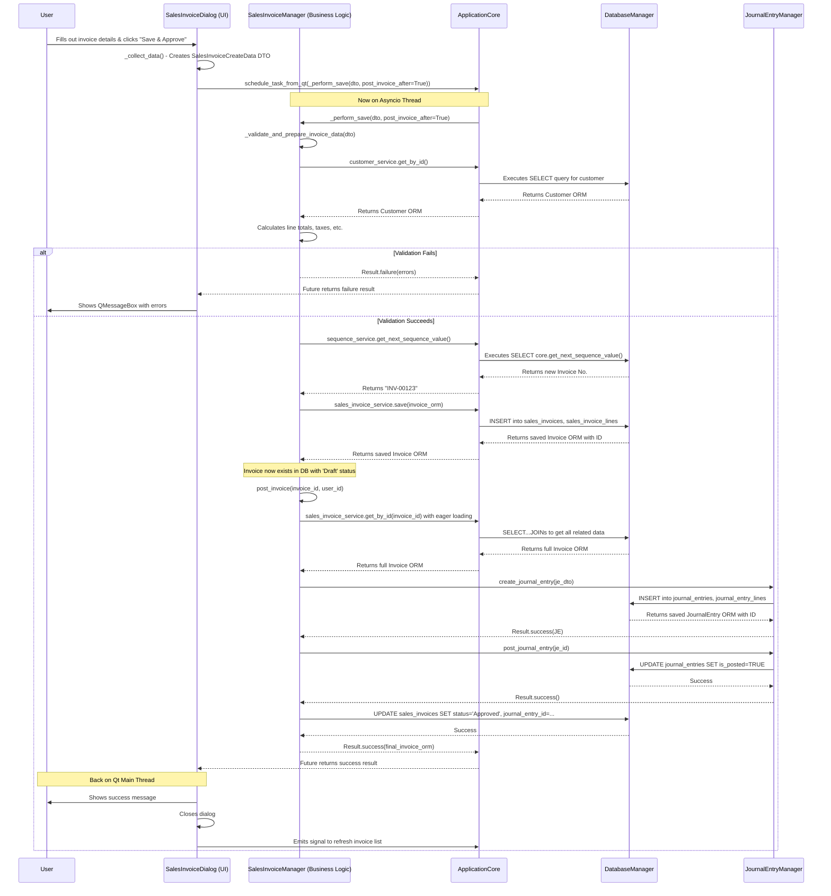

# Project Architecture Overview Document: SG Bookkeeper

## 1. Introduction

### 1.1. Project Vision

SG Bookkeeper is a desktop application designed to provide a comprehensive, modern, and user-friendly accounting solution for small to medium-sized enterprises (SMEs) in Singapore. The primary goal is to simplify complex bookkeeping tasks, including GST compliance, financial reporting, and daily transaction management, through an intuitive graphical user interface (GUI).

The project's philosophy is rooted in creating a robust, maintainable, and scalable application. It leverages a professional software architecture to ensure a clear separation of concerns, which facilitates testing, debugging, and future feature development.

### 1.2. Target Audience

The application is built for business owners, accountants, and bookkeepers who require a reliable tool to manage financial data locally. It prioritizes data integrity, user experience, and performance.

### 1.3. Core Technologies

-   **Backend Language:** Python (>=3.9)
-   **GUI Framework:** PySide6 (The official Python bindings for the Qt framework)
-   **Database:** PostgreSQL
-   **ORM (Object-Relational Mapper):** SQLAlchemy 2.0 (with async support via `asyncpg`)
-   **Data Validation:** Pydantic
-   **Dependency Management:** Poetry

## 2. High-Level Architecture: A Layered Approach

The application is architected using a classic multi-layered approach. This design separates the application into logical groups of functionality, where each layer has a specific responsibility and communicates only with adjacent layers. This reduces coupling and makes the system significantly easier to understand and evolve.

```mermaid
graph TD
    A[UI Layer (app/ui)] -->|Calls methods on| B(Business Logic Layer (app/business_logic, app/accounting));
    B -->|Uses| C(Service Layer / DAL (app/services));
    C -->|Executes queries via| D(Database Manager (app/core/database_manager));
    D <--> E[PostgreSQL Database];
    
    subgraph "Core & Utilities"
        F[Application Core (app/core/application_core)]
        G[Utility Modules (app/utils)]
        H[Shared Enums (app/common)]
    end
    
    B --> F;
    A --> F;
    C --> F;
    F --> D;

    style A fill:#cde4ff,stroke:#333,stroke-width:2px
    style B fill:#d5e8d4,stroke:#333,stroke-width:2px
    style C fill:#ffe6cc,stroke:#333,stroke-width:2px
    style D fill:#f8cecc,stroke:#333,stroke-width:2px
    style E fill:#dae8fc,stroke:#333,stroke-width:2px
    style F fill:#e1d5e7,stroke:#333,stroke-width:2px
    style G fill:#fff2cc,stroke:#333,stroke-width:2px
    style H fill:#fff2cc,stroke:#333,stroke-width:2px
```

### 2.1. Presentation (UI) Layer

-   **Location:** `app/ui/`
-   **Responsibility:** All user interaction, data display, and input capturing. This layer is built with **PySide6**. It is intentionally kept "thin," meaning it contains minimal business logic. Its primary role is to present data to the user and delegate user actions to the Business Logic Layer.
-   **Key Components:**
    -   **Widgets (`*_widget.py`):** Main views for each module (e.g., `CustomersWidget`, `SalesInvoicesWidget`). These typically contain a `QTableView` to display data lists and a `QToolBar` for actions.
    -   **Dialogs (`*_dialog.py`):** Forms for creating and editing records (e.g., `CustomerDialog`, `JournalEntryDialog`). They are responsible for input validation at the field level and collecting data into DTOs.
    -   **Models (`*_table_model.py`):** Subclasses of `QAbstractTableModel` that act as an intermediary between the raw data (a list of DTOs) and the `QTableView`, handling data formatting and display logic.

-   **Example Snippet (`app/ui/customers/customers_widget.py`):** This snippet shows how the widget initiates data loading. It calls `schedule_task_from_qt` to run the `_load_customers` coroutine on the background thread, ensuring the UI remains responsive. The result is then passed back to `_update_table_model_slot` on the UI thread.

    ```python
    # In CustomersWidget class
    def __init__(self, app_core: ApplicationCore, parent: Optional["QWidget"] = None):
        super().__init__(parent)
        self.app_core = app_core
        # ... UI initialization ...
        QTimer.singleShot(0, lambda: schedule_task_from_qt(self._load_customers()))

    async def _load_customers(self):
        # ...
        try:
            result: Result[List[CustomerSummaryData]] = await self.app_core.customer_manager.get_customers_for_listing(
                # ... filter parameters ...
            )
            
            if result.is_success:
                data_for_table = result.value if result.value is not None else []
                # Serialize data to a thread-safe format (JSON string)
                json_data = json.dumps([dto.model_dump() for dto in data_for_table], default=json_converter)
                # Safely invoke the UI update slot on the main Qt thread
                QMetaObject.invokeMethod(self, "_update_table_model_slot", Qt.ConnectionType.QueuedConnection, Q_ARG(str, json_data))
            # ... error handling ...
        # ... exception handling ...

    @Slot(str)
    def _update_table_model_slot(self, json_data_str: str):
        try:
            # Deserialize and update the table model
            list_of_dicts = json.loads(json_data_str, object_hook=json_date_hook)
            customer_summaries: List[CustomerSummaryData] = [CustomerSummaryData.model_validate(item) for item in list_of_dicts]
            self.table_model.update_data(customer_summaries)
        # ... exception handling ...
    ```

### 2.2. Business Logic Layer

-   **Location:** `app/business_logic/`, `app/accounting/`, `app/tax/`, etc.
-   **Responsibility:** This is the core of the application's functionality. It contains "Manager" classes (e.g., `CustomerManager`, `JournalEntryManager`) that orchestrate business processes.
-   **Key Actions:**
    -   Receives high-level requests from the UI (e.g., "create a new customer").
    -   Uses Pydantic DTOs to validate incoming data structures.
    -   Performs business-specific validation (e.g., "Does a customer with this code already exist?").
    -   Coordinates operations across one or more **Services** from the layer below. For example, creating a Sales Invoice might involve the `SalesInvoiceService`, `ProductService` (to check stock), and `JournalEntryManager`.
    -   Returns a `Result` object to the caller, encapsulating the success or failure of the operation.

-   **Example Snippet (`app/business_logic/customer_manager.py`):** This method demonstrates the manager's role: receiving a DTO, performing validation by calling its own validation logic and other services, creating an ORM object, and saving it via its service.

    ```python
    # In CustomerManager class
    async def create_customer(self, dto: CustomerCreateData) -> Result[Customer]:
        validation_errors = await self._validate_customer_data(dto)
        if validation_errors:
            return Result.failure(validation_errors)

        try:
            customer_orm = Customer(
                customer_code=dto.customer_code, name=dto.name,
                # ... copy all other fields from dto to ORM model ...
                created_by_user_id=dto.user_id,
                updated_by_user_id=dto.user_id
            )
            saved_customer = await self.customer_service.save(customer_orm)
            return Result.success(saved_customer)
        except Exception as e:
            self.logger.error(f"Error creating customer '{dto.customer_code}': {e}", exc_info=True)
            return Result.failure([f"An unexpected error occurred while creating the customer: {str(e)}"])

    async def _validate_customer_data(self, dto: CustomerCreateData | CustomerUpdateData, existing_customer_id: Optional[int] = None) -> List[str]:
        errors: List[str] = []
        # Check for duplicate code
        existing_by_code = await self.customer_service.get_by_code(dto.customer_code)
        if existing_by_code and (existing_customer_id is None or existing_by_code.id != existing_customer_id):
            errors.append(f"Customer code '{dto.customer_code}' already exists.")
        
        # Check if linked GL account is valid
        if dto.receivables_account_id is not None:
            acc = await self.account_service.get_by_id(dto.receivables_account_id)
            if not acc or not acc.is_active or acc.account_type != 'Asset':
                errors.append("Invalid or inactive receivables account selected.")
        
        return errors
    ```

### 2.3. Service (Data Access) Layer

-   **Location:** `app/services/`
-   **Responsibility:** This layer forms the Data Access Layer (DAL). It completely abstracts the database from the rest of the application. Each service implements the **Repository Pattern**, providing a clean API for CRUD (Create, Read, Update, Delete) operations on a specific database entity.
-   **Key Characteristics:**
    -   Contains no business logic. Its methods map directly to database operations (e.g., `SELECT`, `INSERT`, `UPDATE`).
    -   Uses SQLAlchemy Core and ORM to construct and execute queries.
    -   Returns ORM models or primitive data types. It does *not* return `Result` objects; error handling at this level is typically done via exceptions, which are caught and converted to `Result` objects by the Business Logic Layer.
    -   Interfaces for each repository are defined in `app/services/__init__.py` (e.g., `ICustomerRepository`), allowing for dependency inversion and easier testing.

-   **Example Snippet (`app/services/business_services.py`):** This method shows a typical service implementation. It builds a SQLAlchemy query, executes it within a session context, and returns the result.

    ```python
    # In CustomerService class (implements ICustomerRepository)
    async def get_all_summary(self, 
                              active_only: bool = True,
                              search_term: Optional[str] = None,
                              page: int = 1, 
                              page_size: int = 50
                             ) -> List[CustomerSummaryData]:
        async with self.db_manager.session() as session:
            conditions = [] 
            if active_only:
                conditions.append(Customer.is_active == True)
            if search_term:
                search_pattern = f"%{search_term}%"
                conditions.append(or_(
                    Customer.customer_code.ilike(search_pattern),
                    Customer.name.ilike(search_pattern),
                    Customer.email.ilike(search_pattern) if Customer.email else False
                ))
            
            stmt = select(
                Customer.id, Customer.customer_code, Customer.name, 
                Customer.email, Customer.phone, Customer.is_active
            )
            if conditions:
                stmt = stmt.where(and_(*conditions))
            
            stmt = stmt.order_by(Customer.name)
            if page_size > 0:
                stmt = stmt.limit(page_size).offset((page - 1) * page_size)
            
            result = await session.execute(stmt)
            # Convert the result mappings to Pydantic DTOs for type safety
            return [CustomerSummaryData.model_validate(row) for row in result.mappings().all()]
    ```

### 2.4. Data Model Layer

-   **Location:** `app/models/`
-   **Responsibility:** Defines the application's data structures using **SQLAlchemy ORM classes**. Each class maps to a database table and defines its columns and relationships.
-   **Key Characteristics:**
    -   Organized into sub-packages that mirror the database schemas (`core`, `accounting`, `business`, `audit`).
    -   Uses `TimestampMixin` and `UserAuditMixin` from `app/models/base.py` to consistently add `created_at`/`updated_at` and `created_by`/`updated_by` fields.
    -   Defines relationships between tables (e.g., one-to-many, many-to-many) using `relationship()` and `ForeignKey`.

-   **Example Snippet (`app/models/business/customer.py`):** This shows how a customer entity is defined, including its columns and its relationship to the `Account` and `User` models.

    ```python
    # In app/models/business/customer.py
    from app.models.base import Base, TimestampMixin
    from app.models.accounting.account import Account
    from app.models.core.user import User
    # ... other imports ...

    class Customer(Base, TimestampMixin):
        __tablename__ = 'customers'
        __table_args__ = {'schema': 'business'} 

        id: Mapped[int] = mapped_column(primary_key=True)
        customer_code: Mapped[str] = mapped_column(String(20), unique=True, nullable=False, index=True)
        name: Mapped[str] = mapped_column(String(100), nullable=False)
        # ... other columns ...
        receivables_account_id: Mapped[Optional[int]] = mapped_column(Integer, ForeignKey('accounting.accounts.id'), nullable=True)

        created_by_user_id: Mapped[int] = mapped_column("created_by", Integer, ForeignKey('core.users.id'), nullable=False)
        updated_by_user_id: Mapped[int] = mapped_column("updated_by", Integer, ForeignKey('core.users.id'), nullable=False)

        # Relationships
        receivables_account: Mapped[Optional["Account"]] = relationship("Account", back_populates="customer_receivables_links", foreign_keys=[receivables_account_id])
        created_by_user: Mapped["User"] = relationship("User", foreign_keys=[created_by_user_id])
        updated_by_user: Mapped["User"] = relationship("User", foreign_keys=[updated_by_user_id])
    ```

## 3. Codebase Directory Structure

The project follows a standard Python package structure that clearly separates concerns into different modules and sub-packages.

```
SG-Bookkeeper/
├── app/                      # Main application source code package
│   ├── accounting/           # Managers for accounting-specific logic (CoA, JEs)
│   ├── business_logic/       # Managers for business entities (Customers, Invoices)
│   ├── common/               # Shared Enum definitions
│   ├── core/                 # Core application components (Core, DB, Security)
│   ├── models/               # SQLAlchemy ORM models, organized by schema
│   │   ├── accounting/
│   │   ├── audit/
│   │   ├── business/
│   │   └── core/
│   ├── reporting/            # Logic for generating reports and KPIs
│   ├── services/             # Data Access Layer (Repositories)
│   ├── tax/                  # Managers and calculators for tax logic (GST)
│   ├── ui/                   # GUI components (Widgets, Dialogs, Models)
│   │   ├── accounting/
│   │   ├── audit/
│   │   ├── banking/
│   │   ├── customers/
│   │   ├── dashboard/
│   │   ├── payments/
│   │   ├── products/
│   │   ├── purchase_invoices/
│   │   ├── reports/
│   │   ├── sales_invoices/
│   │   ├── settings/
│   │   ├── shared/
│   │   └── vendors/
│   ├── utils/                # Utility functions and Pydantic DTOs
│   ├── main.py               # Main application entry point, starts Qt app and asyncio loop
│   └── resources_rc.py       # Compiled Qt resources (generated file)
│
├── data/                     # Data files for initialization or templates
│   ├── chart_of_accounts/    # Default CoA templates
│   └── tax_codes/            # Default tax code definitions
│
├── resources/                # Source assets for the UI
│   ├── icons/                # .svg icon files
│   └── images/               # .png image files
│
├── scripts/                  # Database scripts
│   ├── db_init.py            # Script to initialize the database
│   ├── initial_data.sql      # SQL to populate default data
│   └── schema.sql            # The master SQL script to create all tables and functions
│
├── tests/                    # All automated tests
│   ├── integration/
│   └── unit/
│
├── .gitignore
├── pyproject.toml            # Poetry project definition and dependencies
└── README.md
```

### Directory Purpose Breakdown

-   **`app/`**: The main Python package for the application.
    -   **`app/core/`**: The heart of the application's backend. `application_core.py` acts as the service container. `database_manager.py` handles all connections and sessions. `security_manager.py` deals with authentication and permissions.
    -   **`app/accounting/`, `app/business_logic/`, `app/tax/`, `app/reporting/`**: These directories contain the **Manager** classes, which form the Business Logic Layer. They are separated by domain to keep the logic organized (e.g., `JournalEntryManager` in `accounting`, `CustomerManager` in `business_logic`).
    -   **`app/common/`**: Contains `enums.py`, providing centralized, strongly-typed enumerations (e.g., `InvoiceStatusEnum`, `ProductTypeEnum`) used throughout the application to prevent magic strings and improve code clarity.
    -   **`app/models/`**: Defines the application's data schema using SQLAlchemy ORM classes. The subdirectories (`accounting`, `business`, etc.) mirror the PostgreSQL schemas, ensuring a clear mapping from code to database structure.
    -   **`app/services/`**: The Data Access Layer. Contains service classes that implement the repository pattern, isolating all database query logic. `__init__.py` defines the interfaces for these services.
    -   **`app/ui/`**: The Presentation Layer. All `PySide6` code resides here, organized into sub-packages for each major application module (e.g., everything related to the customer screen is in `app/ui/customers/`).
    -   **`app/utils/`**: A collection of cross-cutting utilities. `pydantic_models.py` is crucial, defining the DTOs that serve as data contracts between layers. `result.py` defines the `Result` object for standardized error handling.
    -   **`app/main.py`**: The application's executable entry point. It handles setting up the critical hybrid threading model (Qt + Asyncio) and launching the `MainWindow`.
-   **`data/`**: Static data used for setup or as templates, such as default charts of accounts.
-   **`resources/`**: Raw UI assets. The `.qrc` file lists these assets so they can be compiled into a single Python file (`resources_rc.py`) for easy distribution.
-   **`scripts/`**: Essential database setup tools. `schema.sql` is the source of truth for the database structure. `db_init.py` is a command-line utility to create and initialize a fresh database from the SQL files.
-   **`tests/`**: Contains all automated tests, separated into `unit` and `integration` tests, mirroring the `app` package structure.

## 4. Application Flow and Module Interaction

Understanding how the layers and modules interact is key to understanding the application. A user action in the UI triggers a cascade of events through the different layers.

### 4.1. Case Study: Creating and Posting a Sales Invoice

This sequence diagram illustrates the complex interactions required for creating and posting a sales invoice, showcasing the collaboration between different application components.



### 4.2. Step-by-Step Breakdown of the Flow

1.  **User Interaction (UI Layer):**
    -   The user opens the `SalesInvoiceDialog` and fills in the customer, products, quantities, and prices.
    -   The user clicks the "Save & Approve" button. The `on_save_and_approve` slot is triggered.

2.  **Data Collection & Task Scheduling (UI Layer -> Core):**
    -   The `on_save_and_approve` method calls `_collect_data()`. This method reads all the values from the input widgets (like `QLineEdit`, `QComboBox`) and constructs a `SalesInvoiceCreateData` DTO. This DTO enforces that required fields are present and have the correct data types.
    -   The UI then calls `schedule_task_from_qt()`, passing it the `_perform_save()` coroutine from the manager. This offloads the entire business logic and database operation to the background `asyncio` thread, keeping the UI from freezing.

3.  **Validation and Preparation (Business Logic Layer):**
    -   On the `asyncio` thread, `SalesInvoiceManager._perform_save()` is executed.
    -   It first calls `_validate_and_prepare_invoice_data()`. This method:
        -   Uses the `customer_service` to ensure the selected customer exists and is active.
        -   Uses the `product_service` to validate each product on each line.
        -   Uses the `tax_calculator` to compute the correct tax for each line.
        -   Calculates all totals (subtotal, total tax, grand total).
    -   If any validation fails, it immediately returns a `Result.failure` object containing the error messages.

4.  **Database Interaction: Saving the Draft (Business Logic -> Service -> DB):**
    -   If validation passes, the manager uses the `sequence_service` to get the next available invoice number (e.g., "INV-00123").
    -   It constructs a `SalesInvoice` ORM object and associated `SalesInvoiceLine` objects from the prepared data. The invoice `status` is set to "Draft".
    -   It calls `self.sales_invoice_service.save(invoice_orm)`.
    -   The `SalesInvoiceService` takes the ORM object and uses its `db_manager` session to perform the `INSERT` operations into the `sales_invoices` and `sales_invoice_lines` tables.
    -   The service returns the saved `SalesInvoice` ORM object, now populated with its new database ID.

5.  **Posting Logic (Business Logic Layer):**
    -   Since `post_after_save` was true, the `_perform_save` method continues. It now calls `self.post_invoice()`.
    -   `post_invoice` fetches the full invoice data again, this time *eagerly loading* all related entities needed for journaling (like customer's AR account, product's sales account, etc.) to avoid multiple small database queries.
    -   It constructs a `JournalEntryData` DTO with all the necessary accounting lines (debiting Accounts Receivable, crediting Sales Revenue, crediting GST Output).
    -   It calls `self.app_core.journal_entry_manager.create_journal_entry()`.
    -   The `JournalEntryManager` creates and saves the journal entry ORM object, which is then also saved to the database in a "Draft" state.
    -   `SalesInvoiceManager` then calls `journal_entry_manager.post_journal_entry()`, which updates the JE's status to "Posted".
    -   Finally, the `SalesInvoiceManager` updates the original `SalesInvoice`'s status to "Approved" and links it to the newly created `journal_entry_id`.

6.  **Returning the Result (All Layers -> UI):**
    -   The final `Result.success(invoice_orm)` is returned from the `SalesInvoiceManager`.
    -   This result propagates back to the `Future` object that the UI was waiting on.
    -   The `add_done_callback` on the `Future` is triggered on the main Qt thread.
    -   The callback function in the `SalesInvoiceDialog` receives the success result, displays an informational `QMessageBox` to the user, and closes itself.

## 5. Database Schema Overview

The database is structured into four logical schemas: `core`, `accounting`, `business`, and `audit`. This separation mirrors the application's domain structure and improves organization and security.

-   **`core` schema:** Contains fundamental tables for application operation, such as `users`, `roles`, `permissions`, `company_settings`, and `sequences`. These are entities that underpin the entire system.
-   **`accounting` schema:** Holds all purely financial and accounting-related tables. This includes the `accounts` (Chart of Accounts), `journal_entries`, `fiscal_years`, `tax_codes`, and `currencies`.
-   **`business` schema:** Contains tables related to operational business entities and documents, such as `customers`, `vendors`, `products`, `sales_invoices`, and `purchase_invoices`. These are the day-to-day documents that drive the accounting entries.
-   **`audit` schema:** Contains tables for logging and history, specifically `audit_log` (for high-level actions) and `data_change_history` (for field-level changes), primarily populated by database triggers.

This structure allows for clear foreign key relationships (e.g., a `business.sales_invoices` record links to an `accounting.journal_entries` record) while maintaining logical separation.

## 6. Getting Started for New Developers

1.  **Environment Setup:**
    -   Install Python (>=3.9).
    -   Install Poetry.
    -   Run `poetry install` in the project root to create a virtual environment and install all dependencies listed in `pyproject.toml`.
    -   Set up a PostgreSQL server.

2.  **Database Initialization:**
    -   Configure your database connection details in `~/.config/SGBookkeeper/config.ini` (or the equivalent path for your OS). If the file doesn't exist, running the app once will create a default.
    -   Run the database initialization script from the project root: `poetry run python scripts/db_init.py`. Use `--drop-existing` if you need to recreate the database from scratch. This script will create the database, all schemas, tables, views, functions, and populate the initial required data.

3.  **Running the Application:**
    -   Compile the Qt resources: `pyside6-rcc resources/resources.qrc -o app/resources_rc.py`.
    -   Run the main application: `poetry run python app/main.py`. The default login is `admin` / `password`.

4.  **Key Files to Study First:**
    -   `app/core/application_core.py`: To understand how all managers and services are tied together.
    -   `app/main.py`: To understand the core concurrency model.
    -   `app/business_logic/customer_manager.py`: A good example of the business logic layer.
    -   `app/ui/customers/customers_widget.py`: A good example of a primary UI module view.
    -   `app/utils/pydantic_models.py`: To understand the data contracts (DTOs) used throughout the app.

