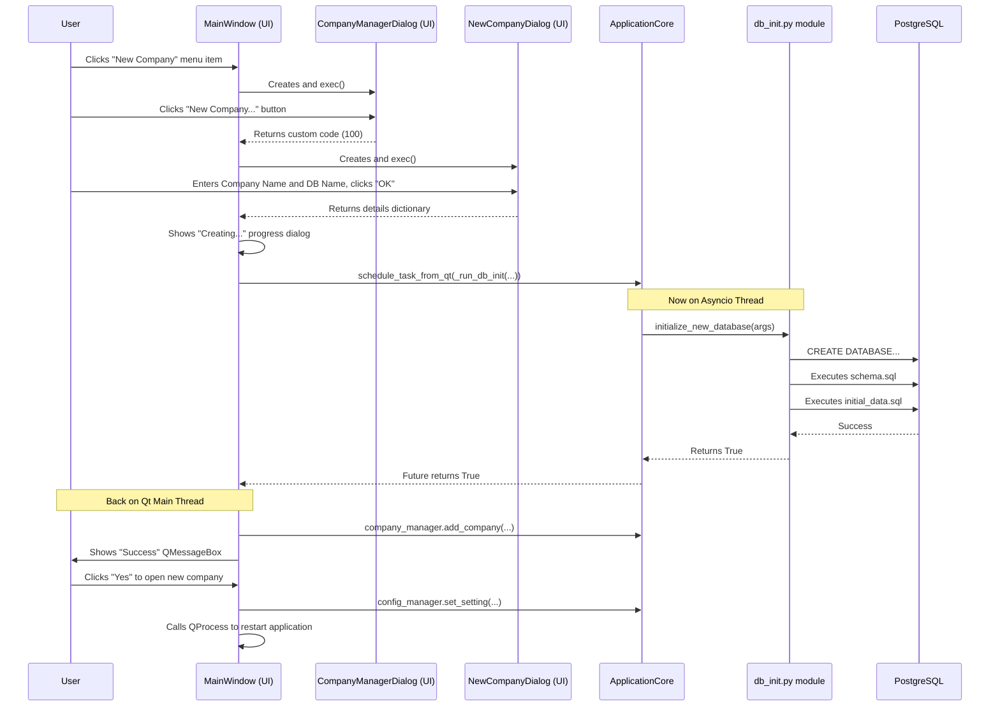

# Technical Design Specification Document: SG Bookkeeper (v17)

**Version:** 17.0
**Date:** 2025-06-10

## 1. Introduction

### 1.1 Purpose
This Technical Design Specification (TDS) document, version **17.0**, provides a detailed and up-to-date overview of the SG Bookkeeper application's technical design and implementation. It reflects the current state of the project, incorporating architectural decisions, component structures, and functionalities up to schema version **1.0.6**. This version specifically details the transition to a **multi-company architecture** and the implementation of the "New Company" and "Open Company" user workflows.

This major architectural enhancement builds upon previously implemented features, including:
*   A refined Bank Reconciliation Module with draft persistence and visual matching aids.
*   An enhanced Dashboard with dynamic KPIs, financial ratios, and graphical aging summaries.
*   A full suite of modules for core accounting, business operations (invoicing, payments), and system administration.

### 1.2 Scope
This TDS covers the following aspects of the SG Bookkeeper application:
-   **System Architecture**: The new multi-company model, UI, business logic, data access layers, and asynchronous processing.
-   **Database Schema**: Details and organization as defined in `scripts/schema.sql` (v1.0.6).
-   **Key UI Implementation Patterns**: `PySide6` interactions for the new company management dialogs and application restart/re-initialization flow.
-   **Core Business Logic**: The structure and role of the new `CompanyManager` and the refactoring of `scripts/db_init.py` for programmatic use.
-   **Data Models & DTOs**: Their structure, purpose, and role in the application.
-   **Security & Data Isolation**: How the new architecture ensures complete data separation between companies.

### 1.3 Intended Audience
-   Software Developers: For implementation, feature development, and understanding system design.
-   QA Engineers: For comprehending system behavior, designing effective test cases, and validation.
-   System Administrators: For deployment strategies, database setup, and maintenance.
-   Technical Project Managers: For project oversight, planning, and resource allocation.

### 1.4 System Overview
SG Bookkeeper is a cross-platform desktop application engineered with Python, utilizing PySide6 for its GUI and PostgreSQL for robust data storage. Its architecture now supports a **multi-company environment**, where each company's data is securely isolated in its own dedicated PostgreSQL database. The application provides a user-friendly interface to create new company databases and switch between them seamlessly.

Its core functionality includes a full double-entry bookkeeping system, Singapore-specific GST management, interactive financial reporting, and modules for managing Customers, Vendors, Products, Sales/Purchase Invoices, and Payments. The advanced Bank Reconciliation module features CSV import with robust error handling, persistent draft states, and visual aids for complex transaction matching. An interactive dashboard provides key financial metrics, including graphical AR/AP aging summaries and important financial ratios, calculated for any user-selected date. The entire system is built with data integrity, security, and auditability as top priorities.

### 1.5 Current Implementation Status
As of version 17.0 (reflecting schema v1.0.6):
*   **Multi-Company Architecture**:
    *   The application is no longer tied to a single database.
    *   A new `CompanyManager` manages a central registry of company databases (`companies.json`).
    *   A new UI workflow (`CompanyManagerDialog`, `NewCompanyDialog`) allows users to list, open, create, and manage their list of company files.
    *   The `scripts/db_init.py` logic has been refactored to be programmatically callable for creating new company databases on the fly.
    *   A robust application restart mechanism has been implemented via `QProcess` to switch company contexts cleanly.
*   **Bank Reconciliation Module**: Fully functional with draft persistence, provisional matching/unmatching, visual grouping, and history viewing.
*   **Dashboard KPIs**: Fully functional with an "As of Date" selector, graphical aging charts, and key financial ratios (Current Ratio, Quick Ratio, Debt-to-Equity).
*   **Database**: Schema is at v1.0.6, which includes a new default corporate tax rate in the `core.configuration` table.
*   **Circular Import Resolution**: Previous refactoring to resolve circular dependencies remains stable.

## 2. System Architecture

### 2.1 High-Level Architecture
The application maintains its robust layered architecture, but now operates within a context defined by the currently selected company database. The core logic remains abstracted from the specific database it is connected to.

```mermaid
graph TD
    subgraph User Interaction
        A[UI Layer (app/ui)]
        I[Company Dialogs (app/ui/company)]
    end

    subgraph Business & Core Logic
        B[Logic Layer (Managers in app/business_logic, etc.)]
        F[Application Core (app/core/application_core)]
        J[Company Manager (app/core/company_manager)]
    end

    subgraph Data & Persistence
        C[Service Layer / DAL (app/services)]
        D[Database Manager (app/core/database_manager)]
        K[Company Registry (companies.json)]
        E[PostgreSQL Databases (One per Company)]
    end

    A -->|User Actions| B;
    I -->|User Actions| F;
    F -->|Restart App| A;
    F -->|Creates DB via| D;
    B -->|Uses Services| C;
    C -->|Uses Sessions from| D;
    D <--> E;
    F -->|Uses| J;
    J <--> K;
```

### 2.2 Component Architecture (Updates for Multi-Company)
The multi-company functionality is primarily managed by new core components and UI dialogs, with minimal changes to the existing business logic and service layers.

#### 2.2.1 Core Components (`app/core/`)
*   **`ApplicationCore` (`application_core.py`)**: Remains the central orchestrator. It now also instantiates and holds a reference to the `CompanyManager`.
*   **`DatabaseManager` (`database_manager.py`)**: Its behavior is now more dynamic. On application startup, it reads the `database` name from the `[Database]` section of `config.ini` to determine which company database to connect to.
*   **`ConfigManager` (`config_manager.py`)**: Unchanged in structure, but now its `config.ini` file is a crucial piece of state that determines the active company on launch. The `database` key is updated by the company switching logic.
*   **`CompanyManager` (`company_manager.py`) - NEW**:
    *   This new class is responsible for managing the central list of companies.
    *   It reads and writes to a `companies.json` file stored in the application's configuration directory.
    *   It provides methods to `get_company_list`, `add_company`, and `remove_company`, abstracting the file I/O from the UI.

#### 2.2.2 UI Layer (`app/ui/`)
*   **`MainWindow` (`main_window.py`)**:
    *   The `on_new_company` and `on_open_company` slots are now fully implemented.
    *   They launch the `CompanyManagerDialog`.
    *   It contains the logic to handle the results from this dialog, including triggering the creation of a new company database or initiating an application restart to switch companies.
    *   The `switch_company_database` method is the key trigger. It updates the `config.ini` and then uses `QProcess` to restart the application.
*   **`CompanyManagerDialog` (`app/ui/company/company_manager_dialog.py`) - NEW**:
    *   The primary interface for company selection.
    *   Uses the `CompanyManager` to populate a `QListWidget` with available companies.
    *   Handles user selections for "Open", "New...", and "Delete". Emits signals or uses specific dialog result codes to communicate the user's choice back to the `MainWindow`.
*   **`NewCompanyDialog` (`app/ui/company/new_company_dialog.py`) - NEW**:
    *   A simple form to capture the "Company Name" and "Database Name" for a new company file.
    *   Includes basic client-side validation to ensure the database name is in a valid format.

#### 2.2.3 Scripts (`scripts/`)
*   **`db_init.py`**:
    *   This script has been refactored. The core logic for creating and initializing a database has been extracted into an `async def initialize_new_database(args)` function.
    *   This allows the `MainWindow` to import and call this function directly, passing it the necessary parameters to programmatically create new company databases without shelling out to a separate process.

### 2.3 Application Restart and Context Switching Flow
The process of switching to a different company database is critical and is designed to be safe and clean.

1.  The user selects a new company to open from the `CompanyManagerDialog`.
2.  The dialog emits a signal with the selected database name.
3.  The `MainWindow.switch_company_database` slot receives this signal.
4.  It calls `self.app_core.config_manager.set_setting("Database", "database", db_name)` to persist the new target database name in `config.ini`.
5.  It shows a `QMessageBox` informing the user that an application restart is required.
6.  Upon user confirmation, it calls `QCoreApplication.instance().quit()` to begin a graceful shutdown of the current instance. The `actual_shutdown_sequence` is triggered, closing the async loop and database connections.
7.  Immediately after calling `quit()`, it uses `QProcess.startDetached(sys.executable, sys.argv)` to launch a brand new instance of the application.
8.  This new instance starts up, reads the `config.ini`, and the `DatabaseManager` now connects to the newly specified company database, effectively loading the new company context.

## 3. Data Architecture
The data architecture now consists of two main parts: the central company registry and the individual company databases.

### 3.1. Company Registry
*   **File:** `companies.json`
*   **Location:** The application's user configuration directory (e.g., `~/.config/SGBookkeeper/`).
*   **Structure:** A JSON array of objects, where each object contains a `display_name` for the UI and a `database_name` for the connection.
    ```json
    [
      {
        "display_name": "My First Company",
        "database_name": "sgb_first_co"
      },
      {
        "display_name": "Second Business Ventures",
        "database_name": "sgb_second_biz"
      }
    ]
    ```

### 3.2. Company Database
*   Each company has its own PostgreSQL database.
*   Every company database is created using the exact same `scripts/schema.sql` (v1.0.6) and is seeded with the same initial data from `scripts/initial_data.sql`.
*   This ensures complete data isolation. There are no foreign keys or links between different company databases.

## 4. Module and Component Specifications
The specifications for the existing modules (Accounting, Sales, Banking, etc.) remain largely unchanged, as they are designed to operate on whichever database the `ApplicationCore` is currently connected to. The key change is the new "Company" module.

### 4.1. Company Module (`app/core/company_manager.py`, `app/ui/company/`)
-   **Purpose**: To abstract the management of multiple company databases.
-   **Core Logic (`CompanyManager`)**: Handles the persistence of the company list to `companies.json`. Provides a simple, synchronous API for the UI to interact with this list.
-   **UI (`CompanyManagerDialog`)**: Provides the user-facing workflow for switching between companies or initiating the creation of a new one. It decouples the `MainWindow` from the details of company selection.
-   **UI (`NewCompanyDialog`)**: A simple, single-purpose dialog for gathering the required information to create a new company file, with basic input validation.

## 5. Data Flow Example: Creating a New Company



## 6. Conclusion
Version 17.0 marks a fundamental architectural evolution for SG Bookkeeper, transforming it into a true multi-company accounting application. The "One Database per Company" model provides the best possible data isolation and scalability. The implementation, centered around a new `CompanyManager` and dedicated UI dialogs, integrates cleanly with the existing application core and restart mechanism. This foundational feature positions the application for more advanced, professional use cases and fulfills a critical long-term roadmap goal.

