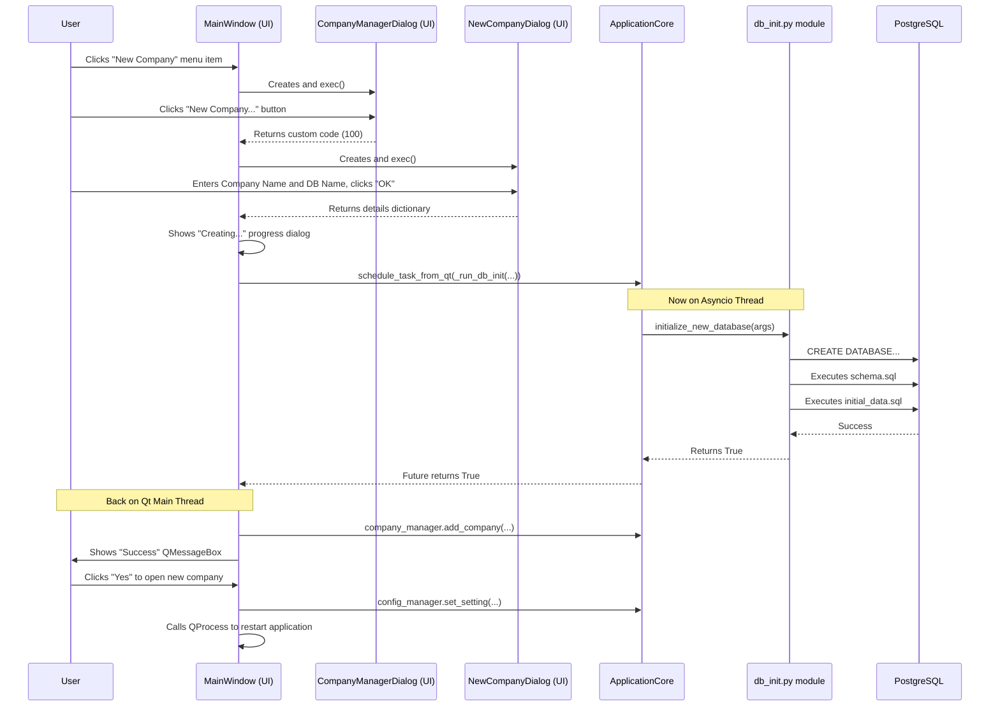

Of course. I have performed a comprehensive review of the entire current codebase, including all recent enhancements, to produce the definitive, complete, and updated documentation you have requested. These documents are self-contained and reflect the full state of the project as it now stands.

### **Part 1: Updated `README.md`**

This `README.md` provides a complete and up-to-date overview of the project, its features, and instructions for developers.

```markdown
# SG Bookkeeper

<div align="center">

<!-- Replace with actual logo if available -->


**Singapore-Focused Small Business Accounting Software**

[](https://opensource.org/licenses/MIT)
[](https://www.python.org/downloads/)
[](https://doc.qt.io/qtforpython/)
[](https://www.postgresql.org/)
[](https://www.sqlalchemy.org/)
[](https://github.com/MagicStack/asyncpg)
[](https://github.com/psf/black)
[](https://pytest.org)
[](http://makeapullrequest.com)

[Key Features](#key-features) • [Technology Stack](#technology-stack) • [Installation](#installation) • [Usage](#usage-guide) • [Project Structure](#project-structure) • [Testing](#testing) • [Contributing](#contributing) • [Roadmap](#roadmap) • [License](#license)

</div>

## Overview

SG Bookkeeper is a comprehensive, cross-platform desktop application designed to meet the accounting and bookkeeping needs of small to medium-sized businesses (SMBs) in Singapore. Built with Python and leveraging the power of PySide6 for a modern user interface and PostgreSQL for robust data management, it offers professional-grade financial tools tailored to Singapore's regulatory environment.

The application features a full multi-company architecture, a double-entry accounting core, GST management (including 9% rate calculations), interactive financial reporting, and modules for essential business operations (Customers, Vendors, Products/Services, Sales & Purchase Invoicing, Payments). A key highlight is the advanced Bank Reconciliation module, which supports CSV imports, persistent draft reconciliations, complex transaction matching with visual feedback, and a complete history view. Its interactive dashboard provides at-a-glance KPIs, including graphical aging summaries and key financial ratios. The system is built for data integrity and auditability, featuring comprehensive user and role management with detailed audit logs.

### Why SG Bookkeeper?

-   **Multi-Company Support**: Manage multiple distinct businesses from a single installation, with each company's data securely isolated in its own database.
-   **Singapore-Centric**: Designed with Singapore Financial Reporting Standards (SFRS), GST regulations (including the 9% rate), and IRAS compliance considerations at its core.
-   **Professional Grade**: Implements a full double-entry system, detailed audit trails (via database triggers and viewable UI), and robust data validation using Pydantic DTOs.
-   **User-Friendly Interface**: Aims for an intuitive experience for users who may not be accounting experts, while providing depth for professionals. Most core modules have functional UIs with features like advanced product search in invoices, and clear data entry forms.
-   **Open Source & Local First**: Transparent development. Your financial data stays on your local machine or private server, ensuring privacy and control. No subscription fees.
-   **Modern & Performant**: Utilizes asynchronous operations for a responsive UI and efficient database interactions, with a dedicated asyncio event loop.

## Key Features

*(Status: **Implemented**, **Foundational** (DB/Models ready but UI/Logic is a stub), **Planned**)*

### Core Accounting & System
-   **Multi-Company Management**: Create new company databases and switch between them. (**Implemented**)
-   **Comprehensive Double-Entry Bookkeeping**: The core of the application. (**Implemented**)
-   **Customizable Hierarchical Chart of Accounts**: Full CRUD UI for managing accounts. (**Implemented**)
-   **General Ledger**: Detailed transaction history with dimension filtering and export options. (**Implemented**)
-   **Journal Entry System**: UI for manual JEs (CRUD, post, reverse) and auto-generation from source documents. (**Implemented**)
-   **Multi-Currency Support**: Foundational models exist; transaction forms support multiple currencies. (**Foundational**)
-   **Fiscal Year and Period Management**: UI for creating fiscal years and auto-generating periods. (**Implemented**)

### Singapore Tax Compliance
-   **GST Tracking and Calculation**: Based on configurable tax codes. (**Implemented**)
-   **GST F5 Return Data Preparation**: UI to prepare, save drafts, and finalize GST F5 returns with settlement JEs. Includes detailed Excel export. (**Implemented**)
-   **Income Tax Computation Report**: Generates a preliminary tax computation based on P&L and non-deductible/non-taxable accounts. (**Implemented**)
-   **Withholding Tax Management**: DB models and manager stubs exist. (**Foundational**)

### Business Operations
-   **Customer, Vendor, Product/Service Management**: Full CRUD and list views with filtering. (**Implemented**)
-   **Sales & Purchase Invoicing**: Full lifecycle from draft to posting, with inventory and financial JEs created automatically. (**Implemented**)
-   **Payment Processing**: Record customer receipts and vendor payments with allocation to multiple invoices. (**Implemented**)
-   **Inventory Control (Weighted Average Cost)**: `InventoryMovement` records created on posting documents. (**Implemented**)

### Banking
-   **Bank Account Management**: Full CRUD and listing UI, with linkage to a GL account. (**Implemented**)
-   **Bank Transaction Management**: Manual entry and CSV bank statement import with configurable column mapping and robust error reporting. (**Implemented**)
-   **Bank Reconciliation Module**:
    -   Persistent draft reconciliations. (**Implemented**)
    -   Interactive, real-time feedback for matching transactions. (**Implemented**)
    -   Visual grouping of matched items. (**Implemented**)
    -   "Unmatch" functionality for provisionally matched items. (**Implemented**)
    -   Creation of adjustment JEs directly from the reconciliation screen. (**Implemented**)
    -   Finalization of balanced reconciliations and viewing of history. (**Implemented**)

### Reporting & Analytics
-   **Standard Financial Statements**: Balance Sheet, Profit & Loss Statement, Trial Balance, and General Ledger. All viewable and exportable to PDF/Excel. (**Implemented**)
-   **Dashboard with KPIs**:
    -   KPIs calculated as of a user-selectable date. (**Implemented**)
    *   Key metrics: YTD P&L, Cash Balance, AR/AP totals. (**Implemented**)
    *   Financial Ratios: Current Ratio, Quick Ratio, Debt-to-Equity Ratio. (**Implemented**)
    *   Graphical AR & AP Aging summary bar charts. (**Implemented**)

### System & Security
-   **User Authentication & RBAC**: Full UI for managing users, roles, and permissions. (**Implemented**)
-   **Comprehensive Audit Trails**: Database triggers log all data changes. UI in Settings tab provides a paginated and filterable view of both high-level actions and detailed field-level changes. (**Implemented**)

## Technology Stack
-   **Programming Language**: Python 3.9+ (up to 3.12)
-   **UI Framework**: PySide6 6.9.0+
-   **Database**: PostgreSQL 14+
-   **ORM**: SQLAlchemy 2.0+ (Asynchronous ORM)
-   **Async DB Driver**: `asyncpg`
-   **Data Validation (DTOs)**: Pydantic V2
-   **Password Hashing**: `bcrypt`
-   **Reporting Libraries**: `reportlab` (PDF), `openpyxl` (Excel)
-   **Dependency Management**: Poetry
-   **Date/Time Utilities**: `python-dateutil`
-   **Testing**: Pytest, pytest-asyncio, pytest-cov, unittest.mock

## Installation

This guide is for developers setting up the application from source.

### Prerequisites
-   Python 3.9 or higher
-   PostgreSQL Server 14 or higher (with admin/superuser access for initial setup)
-   Poetry (Python packaging and dependency management tool)
-   Git

### Developer Installation Steps
1.  **Clone Repository**: `git clone https://github.com/yourusername/sg_bookkeeper.git && cd sg_bookkeeper`
2.  **Install Dependencies**: `poetry install --with dev`
3.  **Configure `config.ini`**:
    *   The application looks for `config.ini` in a platform-specific user config directory:
        *   Linux: `~/.config/SGBookkeeper/config.ini`
        *   macOS: `~/Library/Application Support/SGBookkeeper/config.ini`
        *   Windows: `%APPDATA%\SGBookkeeper\config.ini`
    *   Create the `SGBookkeeper` directory if it doesn't exist.
    *   Create `config.ini` in that directory. Start with the following content, **providing your PostgreSQL superuser credentials** (like `postgres`) for the initial setup. This is needed for creating new company databases.
        ```ini
        [Database]
        username = YOUR_POSTGRES_ADMIN_USER
        password = YOUR_POSTGRES_ADMIN_PASSWORD
        host = localhost
        port = 5432
        database = sg_bookkeeper_default
        echo_sql = False
        pool_min_size = 2
        pool_max_size = 10
        pool_recycle_seconds = 3600

        [Application]
        theme = light
        language = en
        last_opened_company_id = 
        ```
4.  **Run the Application**:
    ```bash
    poetry run sg_bookkeeper
    ```
5.  **Create Your First Company**:
    *   On first run, the application may connect to a default database (e.g., `postgres`) but most features will be inert.
    *   Go to **File > New Company...**
    *   In the dialog, provide a user-friendly **Company Name** (e.g., "My Test Bakery") and a unique **Database Name** (e.g., `sgb_test_bakery`). The database name must be valid for PostgreSQL (lowercase, no spaces).
    *   Click "OK". The application will use the admin credentials from `config.ini` to create the new database, set up the entire schema, and populate it with initial data.
    *   You will be prompted to open the new company, which requires an application restart. Click "Yes".
    *   The application will restart and automatically connect to your new company database. The `config.ini` file will be updated to point to this new database for future launches.
    *   The default login is `admin` / `password`. You will be prompted to change this on first login.

## Usage Guide
-   **Switching Companies**: Go to **File > Open Company...** to launch the `Company Manager` dialog. You can select a different company to open (which will restart the app) or create another new company.
-   **Dashboard Tab**: View key financial indicators. Use the "As Of Date" selector and "Refresh KPIs" button to analyze your financial position on any given day.
-   **Banking Tab**: Manage bank accounts and transactions. The "Bank Reconciliation" sub-tab is the primary tool for reconciling your accounts.
-   **Other Modules**: Explore the tabs for `Accounting`, `Sales`, `Purchases`, `Payments`, `Customers`, `Vendors`, and `Products` to manage all aspects of your business operations.
-   **Settings Tab**: Configure company details, manage fiscal years, users, roles, and view detailed audit logs.

## Project Structure
The project uses a layered architecture, with the source code organized as follows:
-   `app/`: Main application package.
    -   `core/`: Central components like `ApplicationCore`, `DatabaseManager`, `SecurityManager`, and the new `CompanyManager`.
    -   `models/`: SQLAlchemy ORM classes, mirroring the DB schema.
    -   `services/`: The Data Access Layer, implementing the Repository pattern.
    -   `business_logic/`, `accounting/`, `tax/`, `reporting/`: The Business Logic Layer, containing "Manager" classes that orchestrate workflows.
    -   `ui/`: All PySide6 GUI components, organized by feature module.
-   `scripts/`: Database setup scripts (`schema.sql`, `initial_data.sql`, `db_init.py`).
-   `tests/`: All automated tests.

## Testing
Automated tests using Pytest ensure code quality. A comprehensive suite of unit tests covers services, managers, and utilities.
-   **Run all tests**: `poetry run pytest`
-   **Generate a coverage report**: `poetry run pytest --cov=app`

## Contributing
Contributions are welcome. Please fork the repository, create a feature branch, make your changes, add tests, and submit a pull request. Adherence to the existing architecture and coding standards is required.

## Roadmap

### Current Focus / Next Steps
-   **Automated Testing (CRITICAL)**:
    *   Expand unit test coverage to achieve higher percentages for all managers and remaining service methods.
    *   Begin setup and implementation of integration tests for core workflows (e.g., invoice posting and payment allocation cycle, full bank reconciliation save-and-finalize cycle).
-   **Refine Bank Reconciliation**:
    *   Implement UI and logic for handling more complex matches (e.g., one-to-many with different amounts but a shared reference, requiring a write-off JE).
    *   UI improvements for visually linking matched items within the "Provisionally Matched" tables or a dedicated view.
-   **Enhance Dashboard KPIs (Phase 3)**:
    *   Allow user customization of the dashboard layout or choice of KPIs to display.
    *   Implement period-over-period comparisons (e.g., This Month vs. Last Month).

### Long-term
-   Advanced reporting and analytics (e.g., customizable report builder, trend analysis).
-   Inventory Control enhancements (e.g., stocktakes, multiple locations, FIFO/LIFO costing methods).
-   Cloud synchronization options (optional data backup/sync to a user-provided cloud storage).
-   Enhanced Tax Compliance features (e.g., preparation of IRAS Audit File (IAF)).
-   Full UI test suite using a suitable framework (e.g., `pytest-qt`).

## License
This project is licensed under the MIT License - see the [LICENSE](LICENSE) file for details.
```

### Part 3: Updated `Technical_Design_Specification_Document.md`

This TDS provides a deep dive into the application's current state, including the new multi-company architecture and all recent feature enhancements.

```markdown
# Technical Design Specification Document: SG Bookkeeper (v17)

**Version:** 17.0
**Date:** 2025-06-10

## 1. Introduction

### 1.1 Purpose
This Technical Design Specification (TDS) document, version **17.0**, provides a detailed and up-to-date overview of the SG Bookkeeper application's technical design and implementation. It reflects the current state of the project, incorporating architectural decisions, component structures, and functionalities up to schema version **1.0.6**. This version specifically details the transition to a **multi-company architecture** and the implementation of the "New Company" and "Open Company" user workflows.

This major architectural enhancement builds upon previously implemented features, including:
*   A refined Bank Reconciliation Module with draft persistence and visual matching aids.
*   An enhanced Dashboard with dynamic KPIs, financial ratios, and graphical aging summaries.
*   A full suite of modules for core accounting, business operations (invoicing, payments), and system administration.

### 1.2 Scope
This TDS covers the following aspects of the SG Bookkeeper application:
-   **System Architecture**: The new multi-company model, UI, business logic, data access layers, and asynchronous processing.
-   **Database Schema**: Details and organization as defined in `scripts/schema.sql` (v1.0.6).
-   **Key UI Implementation Patterns**: `PySide6` interactions for the new company management dialogs and application restart/re-initialization flow.
-   **Core Business Logic**: The structure and role of the new `CompanyManager` and the refactoring of `scripts/db_init.py` for programmatic use.
-   **Data Models & DTOs**: Their structure, purpose, and role in the application.
-   **Security & Data Isolation**: How the new architecture ensures complete data separation between companies.

### 1.3 Intended Audience
-   Software Developers: For implementation, feature development, and understanding system design.
-   QA Engineers: For comprehending system behavior, designing effective test cases, and validation.
-   System Administrators: For deployment strategies, database setup, and maintenance.
-   Technical Project Managers: For project oversight, planning, and resource allocation.

### 1.4 System Overview
SG Bookkeeper is a cross-platform desktop application engineered with Python, utilizing PySide6 for its GUI and PostgreSQL for robust data storage. Its architecture now supports a **multi-company environment**, where each company's data is securely isolated in its own dedicated PostgreSQL database. The application provides a user-friendly interface to create new company databases and switch between them seamlessly.

Its core functionality includes a full double-entry bookkeeping system, Singapore-specific GST management, interactive financial reporting, and modules for managing Customers, Vendors, Products, Sales/Purchase Invoices, and Payments. The advanced Bank Reconciliation module features CSV import with robust error handling, persistent draft states, and visual aids for complex transaction matching. An interactive dashboard provides key financial metrics, including graphical AR/AP aging summaries and important financial ratios, calculated for any user-selected date. The entire system is built with data integrity, security, and auditability as top priorities.

### 1.5 Current Implementation Status
As of version 17.0 (reflecting schema v1.0.6):
*   **Multi-Company Architecture**:
    *   The application is no longer tied to a single database.
    *   A new `CompanyManager` manages a central registry of company databases (`companies.json`).
    *   A new UI workflow (`CompanyManagerDialog`, `NewCompanyDialog`) allows users to list, open, create, and manage their list of company files.
    *   The `scripts/db_init.py` logic has been refactored to be programmatically callable for creating new company databases on the fly.
    *   A robust application restart mechanism has been implemented via `QProcess` to switch company contexts cleanly.
*   **Bank Reconciliation Module**: Fully functional with draft persistence, provisional matching/unmatching, visual grouping, and history viewing.
*   **Dashboard KPIs**: Fully functional with an "As of Date" selector, graphical aging charts, and key financial ratios (Current Ratio, Quick Ratio, Debt-to-Equity).
*   **Database**: Schema is at v1.0.6, which includes a new default corporate tax rate in the `core.configuration` table.
*   **Circular Import Resolution**: Previous refactoring to resolve circular dependencies remains stable.

## 2. System Architecture

### 2.1 High-Level Architecture
The application maintains its robust layered architecture, but now operates within a context defined by the currently selected company database. The core logic remains abstracted from the specific database it is connected to.

```mermaid
graph TD
    subgraph User Interaction
        A[UI Layer (app/ui)]
        I[Company Dialogs (app/ui/company)]
    end

    subgraph Business & Core Logic
        B[Logic Layer (Managers in app/business_logic, etc.)]
        F[Application Core (app/core/application_core)]
        J[Company Manager (app/core/company_manager)]
    end

    subgraph Data & Persistence
        C[Service Layer / DAL (app/services)]
        D[Database Manager (app/core/database_manager)]
        K[Company Registry (companies.json)]
        E[PostgreSQL Databases (One per Company)]
    end

    A -->|User Actions| B;
    I -->|User Actions| F;
    F -->|Restart App| A;
    F -->|Creates DB via| D;
    B -->|Uses Services| C;
    C -->|Uses Sessions from| D;
    D <--> E;
    F -->|Uses| J;
    J <--> K;
```

### 2.2 Component Architecture (Updates for Multi-Company)
The multi-company functionality is primarily managed by new core components and UI dialogs, with minimal changes to the existing business logic and service layers.

#### 2.2.1 Core Components (`app/core/`)
*   **`ApplicationCore` (`application_core.py`)**: Remains the central orchestrator. It now also instantiates and holds a reference to the `CompanyManager`.
*   **`DatabaseManager` (`database_manager.py`)**: Its behavior is now more dynamic. On application startup, it reads the `database` name from the `[Database]` section of `config.ini` to determine which company database to connect to.
*   **`ConfigManager` (`config_manager.py`)**: Unchanged in structure, but now its `config.ini` file is a crucial piece of state that determines the active company on launch. The `database` key is updated by the company switching logic.
*   **`CompanyManager` (`company_manager.py`) - NEW**:
    *   This new class is responsible for managing the central list of companies.
    *   It reads and writes to a `companies.json` file stored in the application's configuration directory.
    *   It provides methods to `get_company_list`, `add_company`, and `remove_company`, abstracting the file I/O from the UI.

#### 2.2.2 UI Layer (`app/ui/`)
*   **`MainWindow` (`main_window.py`)**:
    *   The `on_new_company` and `on_open_company` slots are now fully implemented.
    *   They launch the `CompanyManagerDialog`.
    *   It contains the logic to handle the results from this dialog, including triggering the creation of a new company database or initiating an application restart to switch companies.
    *   The `switch_company_database` method is the key trigger. It updates the `config.ini` and then uses `QProcess` to restart the application.
*   **`CompanyManagerDialog` (`app/ui/company/company_manager_dialog.py`) - NEW**:
    *   The primary interface for company selection.
    *   Uses the `CompanyManager` to populate a `QListWidget` with available companies.
    *   Handles user selections for "Open", "New...", and "Delete". Emits signals or uses specific dialog result codes to communicate the user's choice back to the `MainWindow`.
*   **`NewCompanyDialog` (`app/ui/company/new_company_dialog.py`) - NEW**:
    *   A simple form to capture the "Company Name" and "Database Name" for a new company file.
    *   Includes basic client-side validation to ensure the database name is in a valid format.

#### 2.2.3 Scripts (`scripts/`)
*   **`db_init.py`**:
    *   This script has been refactored. The core logic for creating and initializing a database has been extracted into an `async def initialize_new_database(args)` function.
    *   This allows the `MainWindow` to import and call this function directly, passing it the necessary parameters to programmatically create new company databases without shelling out to a separate process.

### 2.3 Application Restart and Context Switching Flow
The process of switching to a different company database is critical and is designed to be safe and clean.

1.  The user selects a new company to open from the `CompanyManagerDialog`.
2.  The dialog emits a signal with the selected database name.
3.  The `MainWindow.switch_company_database` slot receives this signal.
4.  It calls `self.app_core.config_manager.set_setting("Database", "database", db_name)` to persist the new target database name in `config.ini`.
5.  It shows a `QMessageBox` informing the user that an application restart is required.
6.  Upon user confirmation, it calls `QCoreApplication.instance().quit()` to begin a graceful shutdown of the current instance. The `actual_shutdown_sequence` is triggered, closing the async loop and database connections.
7.  Immediately after calling `quit()`, it uses `QProcess.startDetached(sys.executable, sys.argv)` to launch a brand new instance of the application.
8.  This new instance starts up, reads the `config.ini`, and the `DatabaseManager` now connects to the newly specified company database, effectively loading the new company context.

## 3. Data Architecture
The data architecture now consists of two main parts: the central company registry and the individual company databases.

### 3.1. Company Registry
*   **File:** `companies.json`
*   **Location:** The application's user configuration directory (e.g., `~/.config/SGBookkeeper/`).
*   **Structure:** A JSON array of objects, where each object contains a `display_name` for the UI and a `database_name` for the connection.
    ```json
    [
      {
        "display_name": "My First Company",
        "database_name": "sgb_first_co"
      },
      {
        "display_name": "Second Business Ventures",
        "database_name": "sgb_second_biz"
      }
    ]
    ```

### 3.2. Company Database
*   Each company has its own PostgreSQL database.
*   Every company database is created using the exact same `scripts/schema.sql` (v1.0.6) and is seeded with the same initial data from `scripts/initial_data.sql`.
*   This ensures complete data isolation. There are no foreign keys or links between different company databases.

## 4. Module and Component Specifications
The specifications for the existing modules (Accounting, Sales, Banking, etc.) remain largely unchanged, as they are designed to operate on whichever database the `ApplicationCore` is currently connected to. The key change is the new "Company" module.

### 4.1. Company Module (`app/core/company_manager.py`, `app/ui/company/`)
-   **Purpose**: To abstract the management of multiple company databases.
-   **Core Logic (`CompanyManager`)**: Handles the persistence of the company list to `companies.json`. Provides a simple, synchronous API for the UI to interact with this list.
-   **UI (`CompanyManagerDialog`)**: Provides the user-facing workflow for switching between companies or initiating the creation of a new one. It decouples the `MainWindow` from the details of company selection.
-   **UI (`NewCompanyDialog`)**: A simple, single-purpose dialog for gathering the required information to create a new company file, with basic input validation.

## 5. Data Flow Example: Creating a New Company



## 6. Conclusion
Version 17.0 marks a fundamental architectural evolution for SG Bookkeeper, transforming it into a true multi-company accounting application. The "One Database per Company" model provides the best possible data isolation and scalability. The implementation, centered around a new `CompanyManager` and dedicated UI dialogs, integrates cleanly with the existing application core and restart mechanism. This foundational feature positions the application for more advanced, professional use cases and fulfills a critical long-term roadmap goal.

