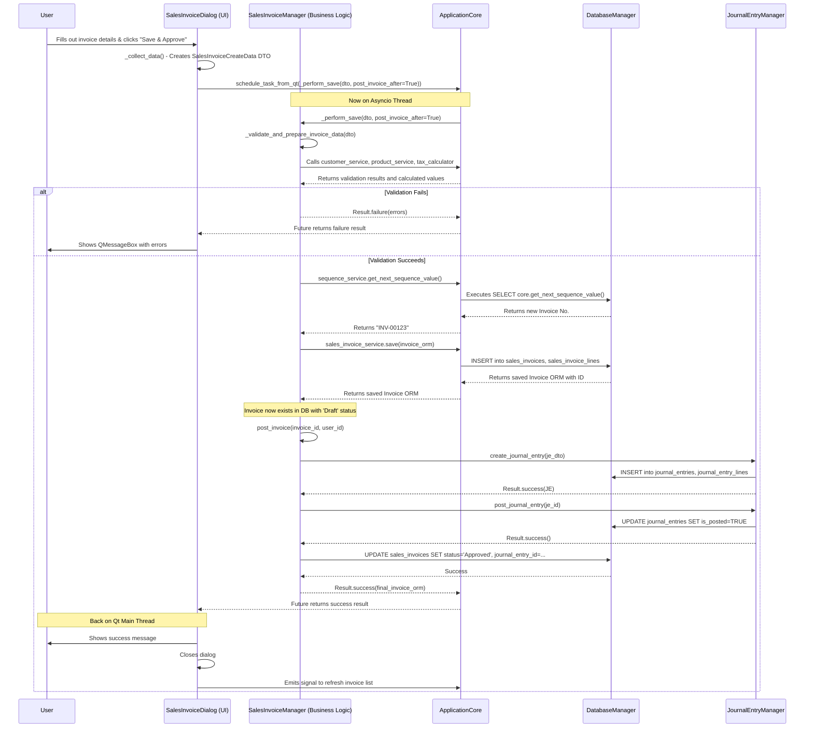
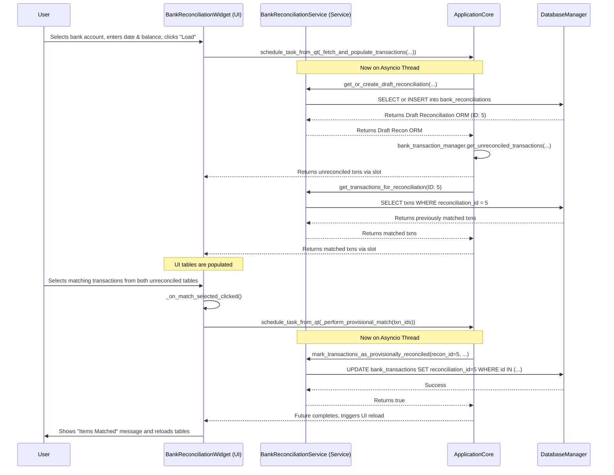
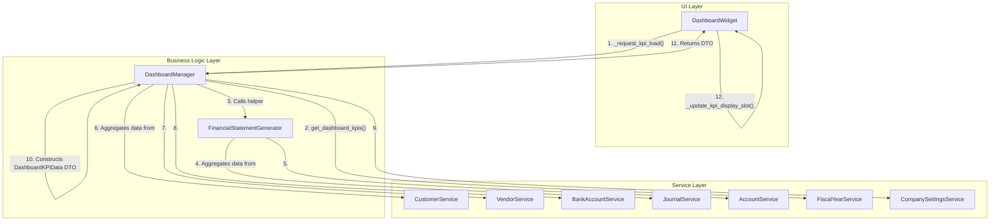

Of course. I have performed a deep analysis of the entire codebase and its components to produce a comprehensive architecture overview. This document is designed to be a definitive guide for any developer, new or existing, to understand the structure, patterns, and flow of the SG Bookkeeper application.

Here is the complete and expanded `Project Architecture Overview Document.md`.

```markdown
# Project Architecture Overview Document: SG Bookkeeper

## 1. Introduction

### 1.1. Project Vision

SG Bookkeeper is a desktop application designed to provide a comprehensive, modern, and user-friendly accounting solution for small to medium-sized enterprises (SMEs) in Singapore. The primary goal is to simplify complex bookkeeping tasks, including GST compliance, financial reporting, and daily transaction management, through an intuitive graphical user interface (GUI).

The project's philosophy is rooted in creating a robust, maintainable, and scalable application. It leverages a professional software architecture to ensure a clear separation of concerns, which facilitates testing, debugging, and future feature development. Key features include detailed financial reporting (Balance Sheet, P&L, Tax Computations), a visual dashboard with key performance indicators (KPIs), and a stateful bank reconciliation module.

### 1.2. Target Audience

The application is built for business owners, accountants, and bookkeepers who require a reliable tool to manage financial data locally. It prioritizes data integrity, user experience, and performance.

### 1.3. Core Technologies

-   **Backend Language:** Python (>=3.9)
-   **GUI Framework:** PySide6 (The official Python bindings for the Qt framework), including the `QtCharts` module for data visualization.
-   **Database:** PostgreSQL
-   **ORM (Object-Relational Mapper):** SQLAlchemy 2.0 (with async support via `asyncpg`)
-   **Data Validation:** Pydantic
-   **Dependency Management:** Poetry

## 2. High-Level Architecture: A Layered Approach

The application is architected using a classic multi-layered approach. This design separates the application into logical groups of functionality, where each layer has a specific responsibility and communicates only with adjacent layers. This reduces coupling and makes the system significantly easier to understand and evolve.

```mermaid
graph TD
    A[UI Layer (app/ui)] -->|Calls methods on| B(Business Logic Layer (app/business_logic, app/accounting));
    B -->|Uses| C(Service Layer / DAL (app/services));
    C -->|Executes queries via| D(Database Manager (app/core/database_manager));
    D <--> E[PostgreSQL Database];
    
    subgraph "Core & Utilities"
        F[Application Core (app/core/application_core)]
        G[Utility Modules (app/utils)]
        H[Shared Enums (app/common)]
    end
    
    B --> F;
    A --> F;
    C --> F;
    F --> D;

    style A fill:#cde4ff,stroke:#333,stroke-width:2px
    style B fill:#d5e8d4,stroke:#333,stroke-width:2px
    style C fill:#ffe6cc,stroke:#333,stroke-width:2px
    style D fill:#f8cecc,stroke:#333,stroke-width:2px
    style E fill:#dae8fc,stroke:#333,stroke-width:2px
    style F fill:#e1d5e7,stroke:#333,stroke-width:2px
    style G fill:#fff2cc,stroke:#333,stroke-width:2px
    style H fill:#fff2cc,stroke:#333,stroke-width:2px
```

### 2.1. Presentation (UI) Layer

-   **Location:** `app/ui/`
-   **Responsibility:** All user interaction, data display, and input capturing. This layer is built with **PySide6**. It is intentionally kept "thin," meaning it contains minimal business logic. Its primary role is to present data to the user and delegate user actions to the Business Logic Layer.
-   **Key Components:**
    -   **Widgets (`*_widget.py`):** Main views for each module (e.g., `CustomersWidget`, `DashboardWidget`). These typically contain a `QTableView` or `QTreeView` to display data lists, `QToolBar` for actions, and various filter controls.
    -   **Dialogs (`*_dialog.py`):** Forms for creating and editing records (e.g., `CustomerDialog`, `JournalEntryDialog`). They are responsible for input validation at the field level and collecting data into DTOs.
    -   **Models (`*_table_model.py`):** Subclasses of `QAbstractTableModel` that act as an intermediary between the raw data (a list of DTOs) and the `QTableView`, handling data formatting and display logic.

-   **Example Snippet (`app/ui/dashboard/dashboard_widget.py`):** This snippet shows how the widget initiates data loading. It calls `schedule_task_from_qt` to run the `_fetch_kpis_data` coroutine on the background thread, ensuring the UI remains responsive. The result is then passed back to `_update_kpi_display_slot` on the UI thread for rendering.

    ```python
    # In DashboardWidget class
    @Slot()
    def _request_kpi_load(self):
        # ... reset UI labels to "Loading..." ...
        self.refresh_button.setEnabled(False)

        as_of_date = self.as_of_date_edit.date().toPython()
        future = schedule_task_from_qt(self._fetch_kpis_data(as_of_date))
        if future:
            future.add_done_callback(
                lambda res: QMetaObject.invokeMethod(self.refresh_button, "setEnabled", Qt.ConnectionType.QueuedConnection, Q_ARG(bool, True))
            )

    async def _fetch_kpis_data(self, as_of_date: python_date):
        # ...
        kpi_data_result = await self.app_core.dashboard_manager.get_dashboard_kpis(as_of_date=as_of_date)
        json_payload = kpi_data_result.model_dump_json() if kpi_data_result else ""
        QMetaObject.invokeMethod(self, "_update_kpi_display_slot", 
                                 Qt.ConnectionType.QueuedConnection, 
                                 Q_ARG(str, json_payload))

    @Slot(str)
    def _update_kpi_display_slot(self, kpi_data_json_str: str):
        # ... deserialize JSON to DTO ...
        # ... update labels and charts with data from DTO ...
    ```

### 2.2. Business Logic Layer

-   **Location:** `app/business_logic/`, `app/accounting/`, `app/tax/`, `app/reporting/`
-   **Responsibility:** This is the core of the application's functionality. It contains "Manager" classes (e.g., `CustomerManager`, `SalesInvoiceManager`, `DashboardManager`) that orchestrate business processes.
-   **Key Actions:**
    -   Receives high-level requests from the UI (e.g., "create a new customer", "get dashboard KPIs").
    -   Uses Pydantic DTOs to validate incoming data structures.
    -   Performs business-specific validation (e.g., "Does a customer with this code already exist?").
    -   Coordinates operations across one or more **Services** from the layer below. For example, creating a Sales Invoice might involve the `SalesInvoiceService`, `ProductService` (to check stock), and `JournalEntryManager`.
    -   Returns a `Result` object to the caller, encapsulating the success or failure of the operation.

-   **Example Snippet (`app/reporting/dashboard_manager.py`):** This method demonstrates the manager's orchestration role. It calls multiple services to aggregate data from different domains (customers, vendors, accounting) to construct a single, cohesive DTO for the UI.

    ```python
    # In DashboardManager class
    async def get_dashboard_kpis(self, as_of_date: Optional[date] = None) -> Optional[DashboardKPIData]:
        # ... determine fiscal year dates ...
        pl_data = await self.app_core.financial_statement_generator.generate_profit_loss(...)

        # --- Aggregate data from multiple services ---
        current_cash_balance = await self._get_total_cash_balance(...)
        total_outstanding_ar = await self.app_core.customer_service.get_total_outstanding_balance()
        total_outstanding_ap = await self.app_core.vendor_service.get_total_outstanding_balance()
        ar_aging_summary = await self.app_core.customer_service.get_ar_aging_summary(...)
        
        # ... calculate financial ratios by fetching accounts and their balances ...
        all_active_accounts: List[Account] = await self.app_core.account_service.get_all_active()
        for acc in all_active_accounts:
            balance = await self.app_core.journal_service.get_account_balance(acc.id, effective_date)
            # ... logic to sum assets and liabilities ...
            
        # --- Construct and return the final DTO ---
        return DashboardKPIData(
            # ... all aggregated and calculated fields ...
        )
    ```

### 2.3. Service (Data Access) Layer

-   **Location:** `app/services/`
-   **Responsibility:** This layer forms the Data Access Layer (DAL). It completely abstracts the database from the rest of the application. Each service implements the **Repository Pattern**, providing a clean API for CRUD (Create, Read, Update, Delete) operations on a specific database entity.
-   **Key Characteristics:**
    -   Contains no business logic. Its methods map directly to database operations (e.g., `SELECT`, `INSERT`, `UPDATE`).
    -   Uses SQLAlchemy Core and ORM to construct and execute queries.
    -   Returns ORM models or primitive data types. It does *not* return `Result` objects; error handling at this level is typically done via exceptions, which are caught and converted to `Result` objects by the Business Logic Layer.
    -   Interfaces for each repository are defined in `app/services/__init__.py` (e.g., `ICustomerRepository`), allowing for dependency inversion and easier testing.

-   **Example Snippet (`app/services/business_services.py`):** This method shows a typical service implementation. It builds a SQLAlchemy query, executes it within a session context, and returns the result.

    ```python
    # In CustomerService class (implements ICustomerRepository)
    async def get_total_outstanding_balance(self) -> Decimal:
        async with self.db_manager.session() as session:
            # Uses a pre-defined database VIEW for efficiency
            stmt = select(func.sum(customer_balances_view_table.c.outstanding_balance))
            result = await session.execute(stmt)
            total_outstanding = result.scalar_one_or_none()
            return total_outstanding if total_outstanding is not None else Decimal(0)
    ```

### 2.4. Data Model Layer

-   **Location:** `app/models/`
-   **Responsibility:** Defines the application's data structures using **SQLAlchemy ORM classes**. Each class maps to a database table and defines its columns and relationships.
-   **Key Characteristics:**
    -   Organized into sub-packages that mirror the database schemas (`core`, `accounting`, `business`, `audit`).
    -   Uses `TimestampMixin` and `UserAuditMixin` from `app/models/base.py` to consistently add `created_at`/`updated_at` and `created_by`/`updated_by` fields.
    -   Defines relationships between tables (e.g., one-to-many, many-to-many) using `relationship()` and `ForeignKey`.

-   **Example Snippet (`app/models/business/bank_reconciliation.py`):** This shows the definition for the new bank reconciliation entity, including its table arguments for constraints and its relationship to `BankTransaction`.

    ```python
    # In app/models/business/bank_reconciliation.py
    class BankReconciliation(Base, TimestampMixin):
        __tablename__ = 'bank_reconciliations'
        __table_args__ = (
            UniqueConstraint('bank_account_id', 'statement_date', name='uq_bank_reconciliation_account_statement_date'),
            CheckConstraint("status IN ('Draft', 'Finalized')", name='ck_bank_reconciliations_status'),
            {'schema': 'business'}
        )
    
        id: Mapped[int] = mapped_column(Integer, primary_key=True)
        # ... other columns ...
        status: Mapped[str] = mapped_column(String(20), default='Draft', nullable=False)
    
        # Relationships
        bank_account: Mapped["BankAccount"] = relationship("BankAccount", back_populates="reconciliations")
        reconciled_transactions: Mapped[List["BankTransaction"]] = relationship(
            "BankTransaction", 
            back_populates="reconciliation_instance"
        )
    ```

## 3. Codebase Directory Structure and Purpose

The project follows a standard Python package structure that clearly separates concerns into different modules and sub-packages.

```
SG-Bookkeeper/
├── app/                      # Main application source code package
│   ├── accounting/           # Managers for accounting-specific logic (CoA, JEs)
│   ├── business_logic/       # Managers for business entities (Customers, Invoices)
│   ├── common/               # Shared Enum definitions
│   ├── core/                 # Core application components (Core, DB, Security)
│   ├── models/               # SQLAlchemy ORM models, organized by schema
│   ├── reporting/            # Logic for generating reports and KPIs
│   ├── services/             # Data Access Layer (Repositories)
│   ├── tax/                  # Managers and calculators for tax logic (GST)
│   ├── ui/                   # GUI components (Widgets, Dialogs, Models)
│   └── utils/                # Utility functions and Pydantic DTOs
├── data/                     # Data files for initialization or templates
├── resources/                # Source assets for the UI
├── scripts/                  # Database scripts
├── tests/                    # All automated tests
├── pyproject.toml            # Poetry project definition and dependencies
└── README.md
```

### Directory Purpose Breakdown

-   **`app/`**: The main Python package for the application. All application logic resides here.
    -   **`app/core/`**: The heart of the application's backend. `application_core.py` acts as the central service container, instantiating and providing access to all managers and services. `database_manager.py` handles all database connections and sessions. `security_manager.py` deals with authentication and permissions.
    -   **`app/accounting/`, `app/business_logic/`, `app/tax/`, `app/reporting/`**: These directories form the **Business Logic Layer**. They contain "Manager" classes responsible for orchestrating complex operations. They are separated by domain to keep the logic organized (e.g., `JournalEntryManager` in `accounting/`, `CustomerManager` in `business_logic/`, `DashboardManager` in `reporting/`).
    -   **`app/common/`**: Contains `enums.py`, providing centralized, strongly-typed enumerations (e.g., `InvoiceStatusEnum`, `ProductTypeEnum`). Using enums prevents "magic strings," improves code clarity, and reduces bugs.
    -   **`app/models/`**: The **Data Model Layer**. It defines the application's database schema using SQLAlchemy ORM classes. The subdirectories (`accounting/`, `business/`, `core/`, `audit/`) mirror the PostgreSQL schemas, ensuring a clear mapping from code to database structure.
    -   **`app/services/`**: The **Data Access Layer (DAL)**. Contains service classes that implement the Repository Pattern, isolating all database query logic. `__init__.py` defines the interfaces for these services, which promotes loose coupling and simplifies testing by allowing mocks to be injected.
    -   **`app/ui/`**: The **Presentation Layer**. All `PySide6` code resides here, organized into sub-packages for each major application module (e.g., `app/ui/customers/`, `app/ui/banking/`). This separation makes finding and updating UI components straightforward.
    -   **`app/utils/`**: A collection of cross-cutting utilities. `pydantic_models.py` is one of the most critical files, defining the DTOs that serve as validated data contracts between layers. `result.py` defines the `Result` object for standardized error handling.
    -   **`app/main.py`**: The application's executable entry point. Its most crucial role is setting up the hybrid threading model (the main Qt GUI thread and the background `asyncio` event loop thread) and launching the `MainWindow`.
-   **`data/`**: Static data files used for setup or as templates, such as default charts of accounts (`.csv`) and report templates (`.json`).
-   **`resources/`**: Raw UI assets like icons (`.svg`) and images (`.png`). The `resources.qrc` file lists these assets so they can be compiled into a single Python file (`resources_rc.py`) for easy distribution within the application package.
-   **`scripts/`**: Essential database setup tools. `schema.sql` is the single source of truth for the database structure. `db_init.py` is a command-line utility that uses this file to create and initialize a fresh database. `initial_data.sql` populates the database with necessary default data like user roles, permissions, and system accounts.
-   **`tests/`**: Contains all automated tests, separated into `unit` and `integration` tests, mirroring the `app` package structure to make tests easy to locate.

## 4. Application Flow and Module Interaction

Understanding how the layers and modules interact is key to understanding the application. A user action in the UI triggers a cascade of events through the different layers.

### 4.1. Case Study 1: Creating and Posting a Sales Invoice

This fundamental workflow illustrates the interaction between all major layers of the application.



### 4.2. Case Study 2: State-aware Bank Reconciliation

The bank reconciliation module demonstrates a more complex state management workflow. Unlike a simple CRUD operation, it involves a "draft" state that persists across user sessions.



### 4.3. Case Study 3: Dashboard KPI Generation

The dashboard showcases how the Business Logic Layer orchestrates data from multiple domains to create a unified view for the user.



**Flow Description:**
1.  The `DashboardWidget` requests a KPI refresh for a specific date.
2.  The request is passed to the `DashboardManager`.
3.  The `DashboardManager` first determines the relevant fiscal year by calling the `FiscalYearService`.
4.  It then calls the `FinancialStatementGenerator` to get YTD Profit & Loss figures.
5.  Simultaneously, it makes parallel calls to various services to gather specific metrics:
    -   `CustomerService` for AR aging and outstanding balances.
    -   `VendorService` for AP aging and outstanding balances.
    -   `BankAccountService` and `JournalService` to calculate the total cash balance.
    -   `AccountService` to get all accounts needed to calculate financial ratios like the Current Ratio.
6.  Once all data is retrieved, the `DashboardManager` performs the final ratio calculations and aggregates all the data into a single `DashboardKPIData` DTO.
7.  This DTO is returned to the `DashboardWidget`, which then populates all its labels and updates its charts with the new, comprehensive data.

## 5. Database Schema Overview

The database is structured into four logical schemas: `core`, `accounting`, `business`, and `audit`. This separation mirrors the application's domain structure and improves organization and security.

-   **`core` schema:** Contains fundamental tables for application operation, such as `users`, `roles`, `permissions`, `company_settings`, and `sequences`. These are entities that underpin the entire system.
-   **`accounting` schema:** Holds all purely financial and accounting-related tables. This includes the `accounts` (Chart of Accounts), `journal_entries`, `fiscal_years`, `tax_codes`, and `currencies`.
-   **`business` schema:** Contains tables related to operational business entities and documents, such as `customers`, `vendors`, `products`, `sales_invoices`, `purchase_invoices`, and the new `bank_reconciliations`. These are the day-to-day documents that drive the accounting entries.
-   **`audit` schema:** Contains tables for logging and history, specifically `audit_log` (for high-level actions) and `data_change_history` (for field-level changes), primarily populated by database triggers.

This structure allows for clear foreign key relationships (e.g., a `business.sales_invoices` record links to an `accounting.journal_entries` record) while maintaining logical separation.

## 6. Getting Started for New Developers

1.  **Environment Setup:**
    -   Install Python (>=3.9).
    -   Install Poetry (`pip install poetry`).
    -   Run `poetry install` in the project root. This creates a virtual environment and installs all dependencies listed in `pyproject.toml`, including development tools like `pytest` and `black`.
    -   Set up a PostgreSQL server locally or have connection details for a remote one.

2.  **Database Initialization:**
    -   Create a `config.ini` file in the appropriate user configuration directory (`~/.config/SGBookkeeper/` on Linux, `%APPDATA%/SGBookkeeper/` on Windows). You can run the app once (`poetry run python app/main.py`) to have it generate a default `config.ini` for you to edit.
    -   Update the `[Database]` section in `config.ini` with your PostgreSQL credentials.
    -   Run the database initialization script from the project root: `poetry run python scripts/db_init.py`.
    -   Use the `--drop-existing` flag if you need to completely wipe and recreate the database (e.g., `poetry run python scripts/db_init.py --drop-existing`). This script will create the database, all schemas, tables, views, functions, and populate the initial required data from `schema.sql` and `initial_data.sql`.

3.  **Running the Application:**
    -   Compile the Qt resources. This bundles icons and images into the application: `pyside6-rcc resources/resources.qrc -o app/resources_rc.py`.
    -   Run the main application: `poetry run python app/main.py`.
    -   The default login is `admin` / `password`. You will be prompted to change this on first login.

4.  **Key Files to Study First:**
    -   `app/core/application_core.py`: To understand how all managers and services are instantiated and connected.
    -   `app/main.py`: To understand the core concurrency model (Qt + Asyncio).
    -   `app/business_logic/sales_invoice_manager.py`: A great example of a complex business process orchestration.
    -   `app/ui/sales_invoices/sales_invoice_dialog.py`: A good example of a complex data entry form.
    -   `app/utils/pydantic_models.py`: To understand the data contracts (DTOs) used throughout the app.
    -   `scripts/schema.sql`: The definitive source for the database structure.

```

---
https://drive.google.com/file/d/13a54HCe719DE9LvoTL2G3fufXVAZ68s9/view?usp=sharing, https://drive.google.com/file/d/16sEyvS8ZfOJFIHl3N-L34xQnhEo5XPcI/view?usp=sharing, https://drive.google.com/file/d/17Lx6TxeEQJauqxEwWQIjL_Vounz-OOuU/view?usp=sharing, https://drive.google.com/file/d/1MxP_SNNW86u44e2wupzz6i2gb0ibGeUE/view?usp=sharing, https://drive.google.com/file/d/1QsDwk2m_1Nh4JHOshQw4zjEI3x1mgGkM/view?usp=sharing, https://drive.google.com/file/d/1XPEV3rOOikcWVvhB7GwX0raI__osRg-Z/view?usp=sharing, https://drive.google.com/file/d/1cJjbc9s6IGkKHeAhk-dh7ey9i7ArJMJe/view?usp=sharing, https://drive.google.com/file/d/1jNlP9TOSJtMzQMeLH1RoqmU2Hx7iwQkJ/view?usp=sharing, https://drive.google.com/file/d/1q3W6Cs4WVx7dLwL1XGN9aQ6bb-hyHmWS/view?usp=sharing, https://drive.google.com/file/d/1qYszGazA6Zm1-3YGdaKdDlPEr3HipU5k/view?usp=sharing, https://drive.google.com/file/d/1uYEc0AZDEBE2A4qrR5O1OFcFVHJsCtds/view?usp=sharing, https://aistudio.google.com/app/prompts?state=%7B%22ids%22:%5B%221v7mZ4CEkZueuPt-aoH1XmYRmOooNELC3%22%5D,%22action%22:%22open%22,%22userId%22:%22103961307342447084491%22,%22resourceKeys%22:%7B%7D%7D&usp=sharing

